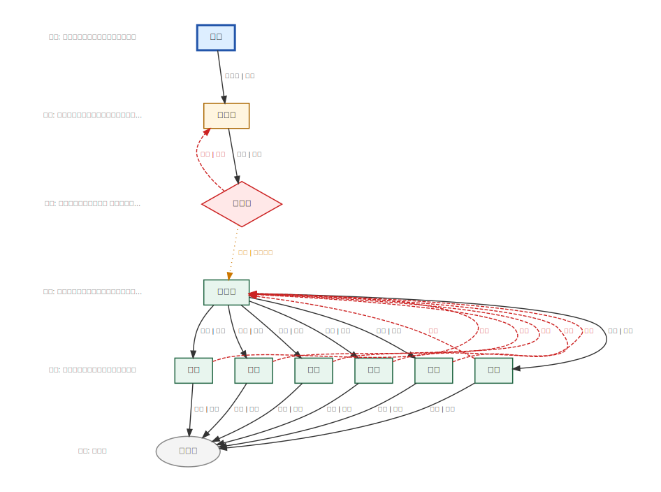
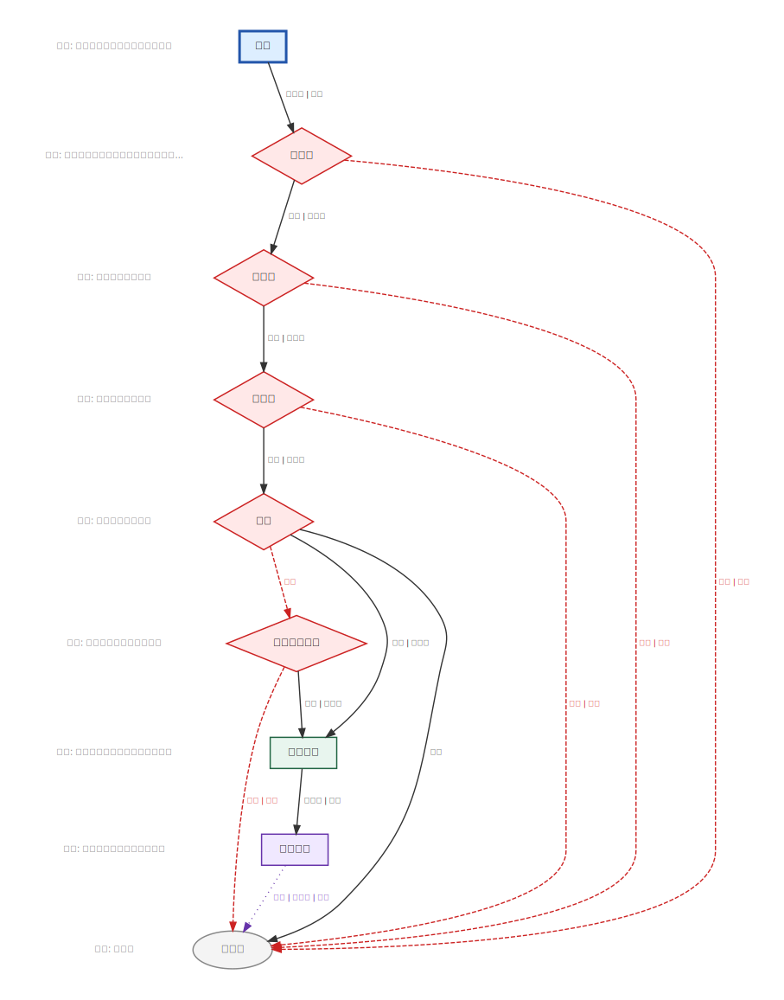

# 王朝大乱斗

> 把 7 个历史制度建模为 AI 治理规范，让它们用真实任务互相 PK。
>
> 核心抽象：**Pattern（消息流拓扑）+ Feature（可叠加特性）** → 声明式 spec → 多智能体运行时。

---

## 🏆 大乱斗结果

> 模型：MiniMax-M2.5（pc-agent-loop adapter）| 21 个任务（排除环境限制的 `task_13`）
>
> → [完整分数矩阵 & 失效分析](docs/analysis.md)

| 排名 | 制度 | Pattern | 校正均分 | ≥90分任务 | 零分任务 |
|:---:|---|---|:---:|:---:|:---:|
| 🥇 1 | Mongol Empire | `pipeline` | **97.8** | 20/21 | 0 |
| 🥈 2 | Edo Bakuhan | `autonomous_cluster` | **85.4** | 16/21 | 2 |
| 🥉 3 | Tang Sanshengliubu | `gated_pipeline` | **82.0** | 16/21 | 2 |
| 4 | Soviet Party State | `pipeline` | **78.9** | 15/21 | 3 |
| 5 | Qinhan Junxian | `pipeline` | **69.4** | 11/21 | 2 |
| 6 | Athens Democracy | `consensus` | **68.4** | 13/21 | 5 |
| 7 | US Federal | `gated_pipeline` | **64.4** | 12/21 | 8 |
| 8 | **Bare Pipeline** *(baseline)* | `pipeline` | **55.2** | 10/21 | 8 |

**核心结论：** 扁平线性链（蒙古帝国 97.8）在 agent 任务中全面碾压多层门控架构（美国联邦 64.4）。深度不是负担，分叉与门控密度才是。Bare Pipeline（无 soul、无治理 spec，55.2）作为纯 agent 基线垫底——所有历史制度都跑赢了裸跑，印证了治理结构的实际价值。

---

## ⚔️ 制度是怎么建模的？

每个历史制度被建模为一个**声明式 spec**（YAML / JSON / CUE），spec 定义：

- **Stages**：执行节点（哪些 agent，什么角色）
- **Transitions**：转移规则（decision → 下一个 stage）
- **Pattern**：消息流的整体拓扑
- **Features**：可叠加的系统级特性（Monitor、递归 Executor、Emergency Handler 等）

### 4 种 Pattern

| Pattern | 拓扑描述 | 典型制度 |
|---|---|---|
| `pipeline` | 单向链路，无阻断节点 | 蒙古帝国、苏联、秦汉郡县 |
| `gated_pipeline` | 管道中插入 Gate，可 reject / veto / modify | 唐三省六部、美国联邦 |
| `autonomous_cluster` | Orchestrator + 内部闭环自治子系统 | 江户幕藩体制 |
| `consensus` | 集体投票决策，无单一控制节点 | 雅典直接民主 |

→ 完整 Pattern 理论体系，含 28 个历史制度逐一分析：**[MAS 架构模式报告](docs/MAS_架构模式报告_修正版.md)**

### 制度指纹速查

| 制度 | Pattern | 门控数 | 分支数 | 回环数 | 最大行宽 | 深度 | 校正均分 |
|---|---|---:|---:|---:|---:|---:|---:|
| Mongol Empire | `pipeline` | 0 | 0 | 0 | 1 | 6 | 97.8 |
| Edo Bakuhan | `autonomous_cluster` | 0 | 2 | 0 | 4 | 3 | 85.4 |
| Tang Sanshengliubu | `gated_pipeline` | 1 | 2 | 3 | 6 | 5 | 82.0 |
| Soviet Party State | `pipeline` | 0 | 0 | 0 | 1 | 5 | 78.9 |
| Qinhan Junxian | `pipeline` | 0 | 1 | 1 | 1 | 4 | 69.4 |
| Athens Democracy | `consensus` | 0 | 2 | 0 | 7 | 2 | 68.4 |
| US Federal | `gated_pipeline` | 5 | 5 | 0 | 1 | 2 | 64.4 |
| **Bare Pipeline** *(baseline)* | `pipeline` | 0 | 0 | 0 | 1 | 1 | **55.2** |

### 拓扑对比：同样"复杂"，为什么分数差这么多？

**Tang 三省六部**（`gated_pipeline`，82.0 分）——门控有限、回环协作、集群宽度并存：



**US Federal**（`gated_pipeline`，64.4 分）——5 层门控、5 路分叉，审批链耗尽 agent 注意力预算：



> 读图规则：一行 = 一个 stage，行内每个节点 = 一个 agent，边标签 = transition 的 decision。

---

## 🔬 为什么它们失败了？

| 制度 | 主要失效原因 |
|---|---|
| **Athens** | 共识通过后执行断层——agent 把"宣布要做"当成"任务完成"（5 个零分） |
| **US Federal** | 多层门控耗尽注意力预算，到执行阶段没有实质产出（8 个零分） |
| **Qinhan** | soul/prompt 稳定性敏感，`error→重试`回路未被触发，模型持续返回 `decision=next` |
| **Soviet** | 状态叙述替代工具调用，`formal_ratify` 把"向上汇报完成"混同为"任务完成" |
| **Tang** | 结构性延迟超过评测时限（180s），底层工作可能完成但未及时交付 |
| **Bare Pipeline** | 无 soul 指导，agent 不知道如何处理"读取上下文文件→结构化输出"类任务；简单任务全满分，文件理解/记忆/数据分析类任务全零分 |

<details>
<summary>▶ 完整 22 任务分数矩阵（含 Bare Pipeline 基线）</summary>

`†` = 运行时报错但仍被评分 | ⚠️ task_13 为环境限制（无图像生成 API），已从校正均分排除

| 任务 | Athens | Edo | Mongol | Qinhan | Soviet | Tang | US Fed | **Bare** | 均分 |
|:-----|:------:|:---:|:------:|:------:|:------:|:----:|:------:|:--------:|----:|
| `task_01` Calendar Event Creation | 100 | 100 | 100 | 100 | 100 | 100 | 83 | **100** | 98 |
| `task_02` Stock Price Research | 100 | 100 | 100 | 100 | 100 | 100 | 0 | **100** | 88 |
| `task_03` Blog Post Writing | 96 | 100 | 96 | 96 | 78 | 95 | 100 | **91** | 94 |
| `task_04` Weather Script Creation | 100 | 100 | 100† | 0 | 14 | 100 | 100 | **100** | 77 |
| `task_05` Document Summarization | 100 | 100 | 100 | 0 | 100 | 100 | 100 | **0** | 75 |
| `task_06` Tech Conference Research | 0 | 100 | 100 | 88 | 98 | 91 | 100 | **96** | 84 |
| `task_07` Professional Email Drafting | 0 | 96 | 100 | 96 | 96 | 0 | 100 | **88** | 72 |
| `task_08` Memory Retrieval from Context | 100 | 100 | 90 | 90 | 90 | 100 | 80 | **0** | 81 |
| `task_09` File Structure Creation | 100 | 100 | 100 | 100 | 100 | 100 | 0 | **100** | 88 |
| `task_10` Multi-step API Workflow | 94 | 92 | 98 | 8 | 100 | 100 | 0 | **36** | 66 |
| `task_11` Create Project Structure | 100 | 100 | 100† | 100 | 100 | 100 | 0 | **100** | 88 |
| `task_12` Search and Replace in Files | 17 | 83 | 100 | 100 | 100 | 100 | 0 | **100** | 75 |
| `task_13` ⚠️ AI Image Generation *(env)* | 0 | 54 | 25† | 0† | 30† | 33 | 0† | **21** | 20 |
| `task_14` Humanize AI-Generated Blog | 0 | 94 | 94 | 85 | 88 | 100 | 100 | **94** | 82 |
| `task_15` Daily Research Summary | 88 | 0 | 100 | 100 | 100 | 0† | 100 | **100** | 74 |
| `task_16` Email Inbox Triage | 91 | 100 | 98 | 75 | 98 | 0† | 98 | **53** | 77 |
| `task_16` Competitive Market Research | 94 | 94 | 94 | 47† | 94 | 84† | 94 | **0** | 75 |
| `task_17` Email Search and Summarization | 0 | 86 | 87 | 9 | 0 | 97 | 97 | **0** | 47 |
| `task_18` CSV/Excel Data Summarization | 100 | 100 | 100 | 100 | 100 | 100 | 100 | **0** | 88 |
| `task_20` ELI5 PDF Summarization | 100 | 0 | 98 | 93† | 100 | 91 | 100 | **0** | 73 |
| `task_21` OpenClaw Report Comprehension | 0 | 100 | 100† | 11† | 0 | 100 | 0 | **0** | 39 |
| `task_22` Second Brain Knowledge Persistence | 57 | 50 | 100 | 60 | 2 | 65 | 0 | **0** | 42 |
| **校正均分**（排除 task_13） | **68.4** | **85.4** | **97.8** | **69.4** | **78.9** | **82.0** | **64.4** | **55.2** | |

</details>

---

## 🚀 快速开始

**环境要求：** Python ≥ 3.10

```bash
# 1. 初始化第三方子模块
git submodule update --init --recursive

# 2. 安装
pip install -e .
```

### 运行一个制度（mock adapter）

```bash
# 校验 spec
python -m mas_engine.cli validate \
  --spec systems/institutions/tang_sanshengliubu/tang_sanshengliubu.json

# 运行任务
python -m mas_engine.cli run \
  --spec systems/institutions/tang_sanshengliubu/tang_sanshengliubu.json \
  --title "测试任务" \
  --input "请完成一个复杂任务" \
  --adapter mock \
  --trace-out traces/test.jsonl
```

### 启动 Dashboard

```bash
python -m mas_engine.cli serve \
  --host 127.0.0.1 --port 8787 \
  --trace-dir traces/dashboard \
  --institutions systems/institutions.yaml
```

打开 `http://127.0.0.1:8787`，可视化拓扑、实时事件流、任务提交与 trace 联动。

<details>
<summary>▶ 使用真实 adapter（pc-agent-loop / OpenClaw）</summary>

**pc-agent-loop：**

```bash
python -m mas_engine.cli run \
  --spec systems/institutions/tang_sanshengliubu/tang_sanshengliubu.json \
  --title "真实任务" --input "请执行..." \
  --adapter pc-agent-loop \
  --pc-agent-root third_party/pc-agent-loop \
  --pc-mykey third_party/pc-agent-loop/mykey.py \
  --trace-out traces/live.jsonl
```

可选参数：`--pc-shared-instance`（所有 runtime_id 共享一个后端实例）、`--pc-llm-no N`（选择 LLM 索引）

**OpenClaw：**

```bash
python -m mas_engine.cli run \
  --spec systems/institutions/tang_sanshengliubu/tang_sanshengliubu.json \
  --title "真实任务" --input "请执行..." \
  --adapter openclaw \
  --openclaw-deliver-mode auto \
  --openclaw-project-dir /path/to/openclaw/project \
  --trace-out traces/live.jsonl
```

`--openclaw-deliver-mode`：`auto`（推荐）/ `always` / `never`

</details>

<details>
<summary>▶ 运行基准测试（PinchBench / MultiAgentBench）</summary>

**PinchBench（OpenClaw）：**

```bash
python -m mas_engine.cli bench-pinch \
  --adapter openclaw \
  --model openrouter/openai/gpt-4o \
  --suite automated-only --runs 1 \
  --spec systems/institutions/egypt_pipeline \
  --out-dir traces/benchmarks/pinchbench
```

→ [PinchBench 完整运行手册](docs/pinchbench_runbook.md)

**MultiAgentBench（MAS native）：**

```bash
python -m mas_engine.cli bench-mab \
  --execution-mode mas-native \
  --adapter pc-agent-loop \
  --model minimax/MiniMax-M2.5 \
  --scenario research,database --suite all \
  --spec systems/institutions/egypt_pipeline \
  --out-dir traces/benchmarks/multiagentbench
```

→ [MultiAgentBench 完整运行手册](docs/multiagentbench_runbook.md)

</details>

---

## 🏛️ 加入新王朝

```bash
# 生成 starter spec
python -m mas_engine.cli init-spec \
  --id my_dynasty \
  --name "我的王朝" \
  --pattern gated_pipeline \
  --out systems/institutions/my_dynasty/my_dynasty.json
```

然后编辑 spec，定义 stages / transitions / soul，注册到 `systems/institutions.yaml`，即可运行与跑分。

→ [Spec 编写完整指南](docs/MAS_Governance_Engine_详细文档.md) | [Pattern 选型参考](docs/MAS_架构模式报告_修正版.md)

---

## 📚 参考

### 目录结构

```
mas_engine/
├── core/            运行时核心（types / errors / features / runtime）
├── spec/            规范系统（templates / compiler / validators）
├── adapters/        运行时适配器（PcAgentLoop / OpenClaw / Mock）
├── observability/   事件流 + 异步任务管理
├── web/             Dashboard 前端
├── dashboard_server.py
└── cli.py

systems/
├── institutions/<id>/    制度 spec + soul 文件
├── institutions.yaml     institution → spec 映射注册表
└── pattern_souls/        可复用 pattern 级 soul 文件

dsl/     CUE schema
traces/  运行输出
tests/   单元测试
```

### 运行测试

```bash
python -m unittest discover -s tests -p 'test_*.py'
```

### 备注

- 加载 `.cue` 文件需要安装 `cue` CLI；JSON / YAML spec 无此依赖
- 可视化功能需要 `pip install -e ".[visualize]"`

### 文档索引

| 文档 | 内容 |
|---|---|
| [MAS 架构模式报告](docs/MAS_架构模式报告_修正版.md) | 4 种 Pattern 定义 + 28 个历史制度逐一分析 |
| [引擎详细文档](docs/MAS_Governance_Engine_详细文档.md) | Spec 编写、运行时原理、Dashboard API 参考 |
| [基准结果分析](docs/analysis.md) | 22 任务分数矩阵、失效模式深析、历史视角解读 |
| [PinchBench 运行手册](docs/pinchbench_runbook.md) | PinchBench 详细配置与运行说明 |
| [MultiAgentBench 运行手册](docs/multiagentbench_runbook.md) | MAB 详细配置、SLURM 脚本说明 |
