# 各种制度

## 古埃及法老制

### 办事流程

法老（神权化身/最高统治）→ 维齐尔（宰相/行政总管）→ 各省省长/诺姆长（地方行政）→ 书吏阶层（税收登记与法律执行）→ 农民与劳工（生产与劳役）

### 拓扑图

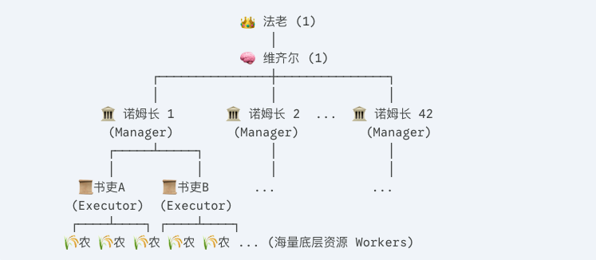

### 职责

| 部门 (古埃及角色)                    | MAS 节点职责 (核心功能)                                                       | 擅长领域 (节点专长与模型配置)                                                                                    |
| ----------------------------- | --------------------------------------------------------------------- | --------------------------------------------------------------------------------------------------- |
| 👑 法老(User / Human)           | 发布顶层任务与最终验收。提出原始需求，设定预算/时间边界，对系统给出的最终结果进行确认或打回。                       | 任何领域（提出需求与核心决策）。作为系统的“甲方”，擅长定义商业价值和最终目标，不需要懂具体的技术实现。                                                |
| 🧠 维齐尔(Planner Agent)         | 全局规划与任务拆解。接收法老的模糊指令，将其转化为结构化的工作流；动态唤醒下级节点；最后汇总所有报告并润色输出。              | 复杂逻辑推理与宏观架构设计。通常由参数量最大、最聪明的大模型（如 GPT-4 / Gemini Pro）担任。擅长统筹全局、长文本理解和解决开放性问题。                        |
| 🏛️ 诺姆长(Manager Agent)        | 中层调度与局部纠错。接收维齐尔派发的专业子任务，将其进一步切碎；并发调度底层的执行者；处理局部报错与重试（Error Handling）。 | 特定领域的流程控制与负载均衡。通常被设定为某个领域的“专家”（如：首席程序员、首席研究员）。擅长管理多线程任务，确保局部工作流不中断。                                 |
| 📜 书吏(Executor Agent)         | 执行原子任务与工具调用。干脏活累活的基层节点。负责执行不可再分的具体动作（如翻译一段话、写一个函数），并严格按照规定格式返回结果。     | 单一专业技能与 API 交互。不需要太强的全局观，通常使用速度快、成本低的小模型（如 GPT-3.5 / Gemini Flash）。擅长专注执行单一指令、调用外部工具（Tool Calling）。 |
| 🌾 农民与劳工(Environment / Tools) | 提供原始数据与被动响应。在 MAS 中，它们是被系统操作的客体。接收“书吏”发来的读/写请求，并返回客观的物理或数据结果。         | 数据存储、检索与物理计算。它们不是 AI，而是传统软件层（如 MySQL 数据库、搜索引擎 API、本地文件系统、Python 运行环境）。擅长忠实地存储和反馈客观事实。               |

## 罗马帝国元首制与君主制

### 办事流程

皇帝/奥古斯都（最高军政与立法权）→ 近卫军长官与帝国顾问团（中枢决策）→ 元老院（名义审议/逐步虚化）→ 行省总督/军团长官（地方行政与驻军）→ 各城市议事会（基层自治）

### 拓扑图

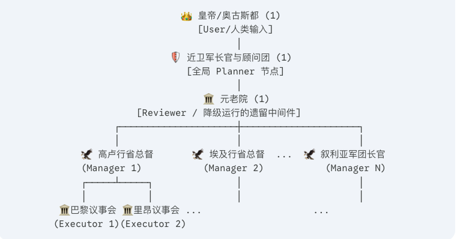

### 职责

| 部门 (罗马帝国角色)           | MAS 节点职责 (核心功能)                                                                                            | 擅长领域 (节点专长与模型配置)                                                                      |
| --------------------- | ---------------------------------------------------------------------------------------------------------- | ------------------------------------------------------------------------------------- |
| 👑 皇帝/奥古斯都(最高军政与立法权)  | 发布最高指令与权限控制。定义系统的终极目标（如“征服高卢”、“修改税法”），掌握系统最高的启停开关（User）。                                                   | 业务抽象与目标定义。作为人类或触发器，不需要懂代码，只需给出明确的 Prompt 和核心约束条件。                                     |
| 🛡️ 近卫军长官与帝国顾问团(中枢决策) | 全局主控与任务拆解 (Planner)。接收皇帝的 Prompt，动用最强的算力生成全局执行计划（Plan），并决定调用哪些下级节点来干活。                                     | 复杂推理与工作流编排。由参数量最大、逻辑最强的大模型（如 Gemini 1.5 Pro）担任。擅长宏观调度和破局思考。                           |
| 🏛️ 元老院(名义审议/逐步虚化)    | 合规检查与日志记录 (Reviewer/Logger)。这是一个极具代表性的“遗留系统”或“护栏节点”。它不负责制定计划，只是走个过场进行安全/伦理审核（名义审议），或者仅仅作为只读的日志记录器存在（逐步虚化）。 | 轻量级规则匹配与合规判定。可以使用规则引擎（非 AI）或轻量模型。擅长挑错、敏感词过滤，或者单纯记录数据流转日志，不阻碍主线程运行。                    |
| 🦅 行省总督/军团长官(地方行政与驻军) | 区域路由与并发调度 (Manager/Router)。接管特定区域/领域的任务块（比如“财务管理”或“前端开发”），负责向基层节点分发具体的 API 调用请求。                           | 特定领域知识与并发控制。垂直领域的专家模型。擅长多线程管理、状态追踪，以及处理基层节点返回的局部错误。                                   |
| 🏛️ 各城市议事会(基层自治)      | 高并发执行与环境交互 (Executor/Tool)。处于架构的最底端，具有一定的“自治”能力，这意味着它们可以独立完成闭环的原子任务（如“查数据库”、“写一段代码”）。                      | 工具调用 (Function Calling) 与极速执行。由大量低成本、高并发的小模型（如 Gemini Flash）担任。擅长快速响应、死磕单一任务并返回标准化结果。 |

## 中国明清内阁制与军机处

### 办事流程

皇帝（独揽决策/朱批）→ 内阁大学士（票拟建议/非法定宰相）或军机大臣（承旨办事/高效机密）→ 六部（依旨执行）→ 督抚（省级执行）→ 州县官（基层落实）

### 拓扑图

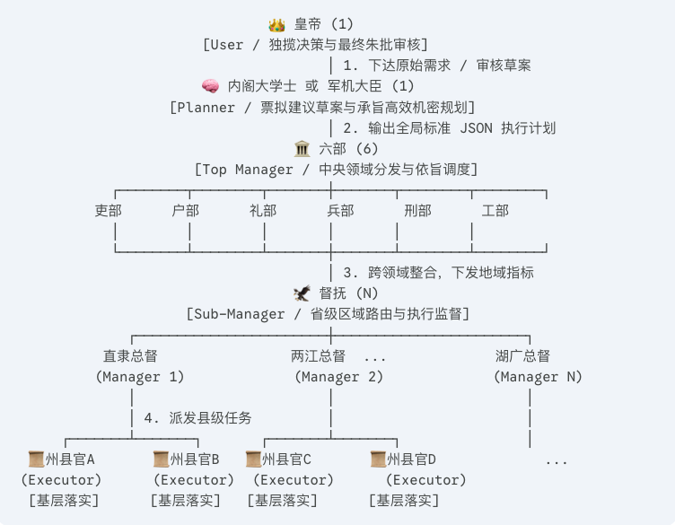

### 职责

| 部门 (明清制度角色)                          | MAS 节点职责 (核心功能)                                                                                                     | 擅长领域 (节点专长与模型配置)                                                                             |
| ------------------------------------ | ------------------------------------------------------------------------------------------------------------------- | -------------------------------------------------------------------------------------------- |
| 👑 皇帝(独揽决策/朱批)                       | 系统总控与人工确认 (Human-in-the-loop)。掌握绝对的系统启动权。Planner 节点生成的计划（票拟）必须经过皇帝节点（User）的最终确认（朱批）后，系统才会真正开始扣除 Token 并向下执行。        | 业务终极拍板与安全熔断。作为人类用户，把控大方向，随时可以手动终止整个 MAS 工作流。                                                 |
| 🧠 内阁 / 军机大臣(票拟建议/非法定宰相 或 承旨办事/高效机密) | 全局规划与 Prompt 优化 (Master Planner)。没有直接调动底层的权限（非法定宰相），职责是将皇帝的“一句话需求”转化为详尽的、可执行的架构方案（票拟）；如果是军机处模式，则具有更高的上下文保密级别（高效机密）。 | 复杂上下文理解与工作流编排。由推理能力最顶尖的大模型担任（如 GPT-4o / Claude 3.5 Sonnet），配置超大上下文窗口，擅长生成 JSON/XML 格式的全局任务书。 |
| 🏛️ 六部(依旨执行)                         | 顶级领域路由 (Domain Router)。接收中央计划后，根据专业领域进行任务分发。例如，涉及“预算”的 API 请求路由给户部 Agent，涉及“人事权限”的路由给吏部 Agent。                      | 垂直领域的规则校验与分流。专家级 Manager，内部硬编码了严格的业务流转规则，确保任务不会分发错部门。                                        |
| 🦅 督抚(省级执行)                          | 二级地域调度与负载均衡 (Regional Manager)。接收六部下发的专业指令，并结合本地（省）的资源情况，将任务进一步切割，分配给下属的各个基层节点。负责监控本地报错（如“某县数据缺失”）。                 | 多线程并发控制与局部状态管理。擅长追踪大批量并行任务的进度，并进行数据的地方性汇总。                                                   |
| 📜 州县官(基层落实)                         | 高并发终端执行 (Executor/Tool Caller)。真正落地干活的底层打工人。不关心国家大事，只负责调用指定的工具（例如执行一段特定的 Python 脚本抓取数据，或向某个数据库写入记录）。                | 工具调用与原子任务死磕。使用响应极快、成本极低的轻量级模型。擅长机械、准确地执行具体的 Function Call，并返回格式化结果。                          |

## 罗马天主教会圣统制

### 办事流程

教皇（最高精神与行政权威）→ 罗马教廷（中央治理中枢）→ 各部/Dicastery（分管专门事务）→ 主教（管理地方教区）→ 神父与执事（堂区基层牧养）

### 拓扑图

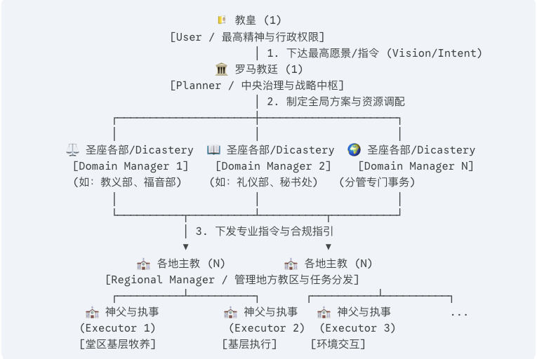

### 职责

| **部门 (圣统制角色)**                 | **MAS 节点职责 (核心功能)**                                                                 | **擅长领域 (节点专长与模型配置)**                                                    |
| ------------------------------ | ----------------------------------------------------------------------------------- | ----------------------------------------------------------------------- |
| **👑 教皇** *(最高权威)*             | **定义终极价值观与系统启停 (User)。** 作为人类输入端，提供最核心的“精神纲领”。所有的执行结果最终都要追溯到教皇的初始意图。                | **宏观愿景与原则设定。** 负责定义系统的“对齐（Alignment）”准则。                                |
| **🏛️ 罗马教廷** *(中央治理中枢)*        | **全局规划与复杂逻辑编排 (Planner)。** 负责将宏大的愿景转化为具体的行政计划。它是系统的大脑，确保全球各地的动作不偏离核心航道。             | **长程规划与全局状态同步。** 由具备极强推理能力和多语言理解的大模型担任，擅长处理超长上下文。                       |
| **⚖️ 各部/Dicastery** *(分管专门事务)* | **垂直领域的规则与逻辑管理 (Domain Manager)。** 每个部会对应一个专业领域（如法律、教义、外交）。它们负责对 Planner 的计划进行专业细化。 | **特定领域的专家逻辑。** 配置了深度领域知识的专家 Agent，擅长进行复杂的规则判定（Constraint Satisfaction）。 |
| **⛪ 主教** *(管理地方教区)*            | **地域路由与负载均衡 (Regional Manager)。** 负责将来自中央各部的指令适配到当地环境（本地化）。监控当地基层节点的运行状态和反馈。        | **本地化适配与环境感知。** 擅长根据地域差异调整任务执行策略（Localized Strategy）。                   |
| **⛪ 神父与执事** *(堂区基层牧养)*         | **高并发终端执行与数据采集 (Executor)。** 真正与外界（教友/用户）进行交互的节点。执行最基础的“牧养”（数据读写、任务反馈、信息传递）工作。      | **高效率交互与原子任务执行。** 由轻量级、响应极快的模型或 API 调用组成。擅长处理高频、碎片化的真实世界请求。             |

## 阿拉伯-伊斯兰哈里发制

### 办事流程

哈里发（政教合一最高领袖）→ 维齐尔（宰相/行政总管）→ 底万（各行政部门/财政/军事/驿站等分司）→ 埃米尔/瓦利（地方省督）→ 卡迪（伊斯兰法官/基层司法与社会管理）

### 拓扑图

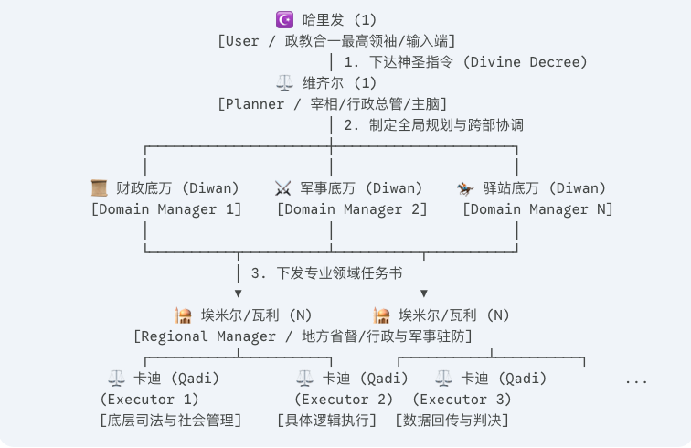

### 职责

| **部门 (哈里发制角色)**             | **MAS 节点职责 (核心功能)**                                                                                 | **擅长领域 (节点专长与模型配置)**                                                 |
| --------------------------- | --------------------------------------------------------------------------------------------------- | -------------------------------------------------------------------- |
| **☪️ 哈里发** *(政教合一领袖)*       | **定义终极目标与对齐准则 (User)。** 提供最高等级的 Prompt。其职责是确保系统运行符合“教义（即核心业务逻辑）”，并拥有最高朱批权。                          | **全局愿景与业务价值定义。** 作为人类介入层，掌握系统的启停和方向修正。                               |
| **⚖️ 维齐尔** *(宰相/行政总管)*      | **全局规划与跨部会编排 (Planner)。** 哈里发的大脑。负责将抽象意图转化为底万可执行的任务清单。具有最高的算力和权限调动底下的资源。                            | **极强的任务调度与策略生成。** 由顶级大模型（如 GPT-4 / Gemini Pro）担任。擅长处理高度复杂的全局统筹。      |
| **📜 底万 (Diwan)** *(各行政部门)* | **专业职能微服务 (Domain Logic Manager)。** 垂直领域的专家节点。每一个“底万”都是一个高度专业化的 Sub-planner（如：财务底万擅长计算，军事底万擅长策略部署）。 | **细分领域的规则引擎与数据处理。** 配置了特定领域 Prompt 的专家 Agent，确保该领域的执行不出错。            |
| **🕌 埃米尔/瓦利** *(地方省督)*      | **区域行政调度与武力保障 (Regional Manager)。** 负责将底万的指令在特定物理省份（或特定数据分区）落地。它们是区域性的协调者，确保任务在局部并发时不冲突。            | **区域化管理与资源调度。** 擅长在限制条件下（如本地资源不足）灵活调整执行路径。                           |
| **⚖️ 卡迪 (Qadi)** *(伊斯兰法官)*  | **基层逻辑执行与合规判定 (Executor/Guardrail)。** 最底层的执行者。不仅是“干活”，更重要的是在干活的过程中进行“司法审查”——确保每个原子动作都符合法律规则。        | **原子级任务执行与规则合规性检查。** 由具备 Function Calling 能力的轻量模型担任。擅长给出标准化、合法的输出结果。 |

## 法国绝对君主制度

### 拓扑图

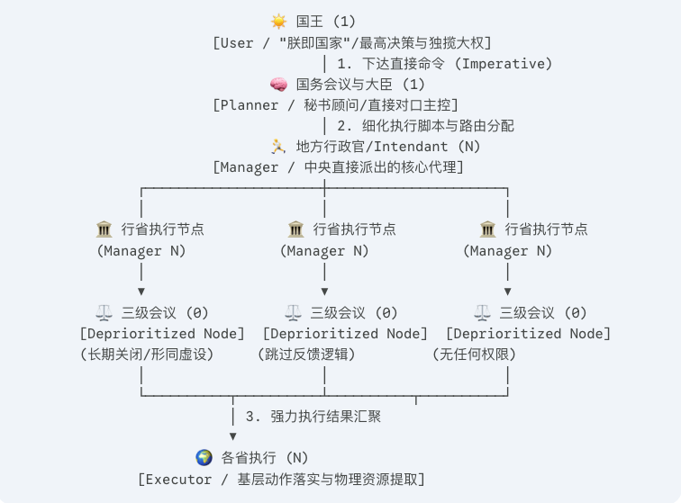

### 职责

| **部门 (绝对君主制角色)**                       | **MAS 节点职责 (核心功能)**                                                                                   | **擅长领域 (节点专长与模型配置)**                                       |
| -------------------------------------- | ----------------------------------------------------------------------------------------------------- | ---------------------------------------------------------- |
| **☀️ 国王** *(朕即国家)*                     | **绝对意志定义与权限锁死 (User)。** 作为唯一的指令源。系统所有行为都必须被标记为“国王意志”。拥有最高级别的安全权限，无需向任何节点解释逻辑。                         | **终极目标设定。** 人类用户节点，负责提供确定性、不可违抗的 Prompt。                   |
| **🧠 国务会议与大臣** *(国王亲自主持)*              | **辅助决策与技术实现规划 (Planner)。** 国王身边的技术顾问。负责把国王的愿望转化为 Intendant 可直接运行的精确指令集。                               | **高精度的指令翻译与工作流规划。** 由具备强指令遵循能力的大模型担任，确保输出的 Plan 绝对符合国王心意。  |
| **🏃 地方行政官 (Intendant)** *(中央派出/架空贵族)* | **强力穿透执行与中央监控 (Active Manager)。** 最核心的 Agent。代表中央直接扎根地方。它们绕过原有的冗长反馈链，直接监控和调度资源。                       | **强制执行与状态监控。** 具备高权限的 Agent，擅长实时反馈底层状态、强制划拨资源，无视地方节点的“请求”。 |
| **⚖️ 三级会议** *(长期不召开/形同虚设)*             | **非活跃/屏蔽的反馈层 (Disabled Reviewer)。** 这是一个**被禁用（Disabled）或设置了 `priority=0`** 的节点。它在架构中存在，但系统的消息流会直接跳过它。 | **无（节点挂起）。** 在 MAS 开发中，这代表不再被维护、被注释掉或被跳过的旧业务逻辑代码。          |
| **🌍 各省执行** *(基层执行)*                   | **物理落地与资源产出 (Executor)。** 纯粹的工具层。接收 Intendant 的指令，完成具体的税务收集、工程建设等任务。                                  | **单一任务高效响应。** 由快速执行的微服务、API 或轻量级模型组成，只负责干活。                |

## 波斯阿契美尼德行省制

### 拓扑图

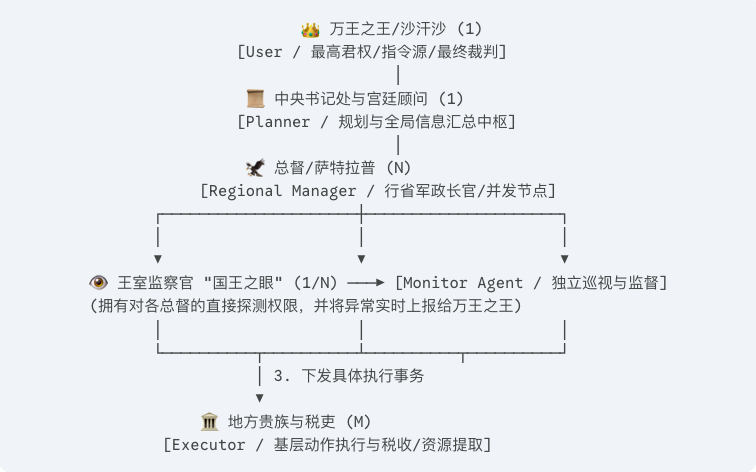

### 职责

| **部门 (波斯制度角色)**                  | **MAS 节点职责 (核心功能)**                                                                                                    | **擅长领域 (节点专长与模型配置)**                                                         |
| -------------------------------- | ---------------------------------------------------------------------------------------------------------------------- | ---------------------------------------------------------------------------- |
| **👑 万王之王/沙汗沙** *(最高君权)*         | **终极意图定义与异常裁决 (User)。** 作为人类输入端，同时接收“顾问”的任务反馈和“国王之眼”的审计报告。拥有最终的“斩首”（节点重置/删除）权限。                                        | **最高级业务决策与资源授权。** 人类用户节点，负责提供核心价值观。                                          |
| **📜 中央书记处与宫廷顾问** *(规划与信息汇总)*    | **全局知识库管理与任务编排 (Planner)。** 负责处理来自各行省的庞大数据，并将其压缩、提炼为皇帝可阅读的报告。                                                          | **长文本处理与多模态数据汇总。** 由具备强大摘要能力和统筹逻辑的模型担任。擅长处理全局任务日志。                           |
| **🦅 总督/萨特拉普** *(行省军政长官)*        | **区域主权代理与资源池管理 (Manager)。** 在特定行省内拥有高度的自治权。在 MAS 中，这意味着它们可以独立决策，无需每一步都请求中央。                                            | **局部环境下的最优决策与并发管理。** 配置了高度自主性的领域模型。擅长在复杂多变的局部环境下维持系统稳定。                      |
| **👁️ 王室监察官 "国王之眼"** *(独立巡视与监督)* | **独立监控与安全审计 (Independent Monitor)。** 这是架构中最特殊的 Agent。它不参与干活，其职责是“看”。它会实时检测总督节点的资源开销、输出质量和是否有异常（如叛变/逻辑死循环），直接向 User 报警。 | **异常检测与合规审计。** 专注于 Pattern Recognition（模式识别）和安全风险评估。它拥有所有中间节点的 Read-only 权限。 |
| **🏛️ 地方贵族与税吏** *(基层执行)*         | **海量终端操作与资源回收 (Executor)。** 负责具体的税务、征兵等 Function Calling 动作。                                                           | **API 交互与高效率计算。** 由极小模型（Flash 类）或纯代码逻辑组成。擅长处理琐碎的数据读写。                        |

## 秦汉郡县制

### 拓扑图

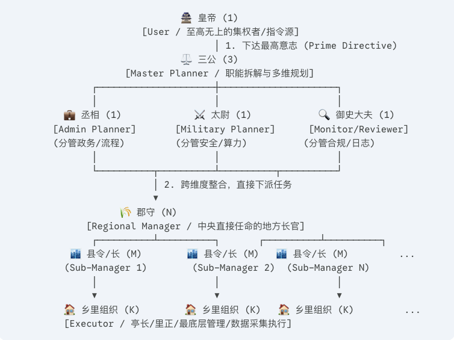

### 职责

| **部门 (秦汉制度角色)**          | **MAS 节点职责 (核心功能)**                                                                       | **擅长领域 (节点专长与模型配置)**                                  |
| ------------------------ | ----------------------------------------------------------------------------------------- | ----------------------------------------------------- |
| **👑 皇帝** *(至高无上)*       | **全局意图定义与终极授权 (User)。** 掌握系统的最高 Prompt。负责在“三公”提交的最终决策结果上签字生效，并拥有对任意节点的一键重置权限。             | **战略定力与核心价值观。** 人类用户节点，负责提供系统的核心对齐准则。                 |
| **⚖️ 三公** *(丞相/太尉/御史大夫)* | **多维并行的 Planner 架构 (Multi-Planner)。** 将任务拆分为政务、军务（安全）、监察（合规）三个并行流。这能防止系统产生逻辑偏见。           | **高层逻辑分流与综合编排。** 由顶级推理模型组成，分别配置专业的“政、军、监”角色设定，实现职能解耦。 |
| **🌾 郡守** *(中央直接任命)*     | **高权限区域路由 (High-Privilege Manager)。** 由于是中央直接任命，它与中央的通信延迟极低，执行力极强。它负责在特定郡（数据分区）内全权调度资源。   | **区域资源的垂直调度与同步。** 擅长在特定环境下强制执行中央指令，不具备地方割据的自治逻辑。      |
| **🏙️ 县令/长** *(基层行政主官)*  | **任务局部细化与调度 (Sub-Manager)。** 将郡级任务拆解为具体的“乡、里”执行动作。它是连接宏观规划与微观执行的关键环节。                     | **任务粒度切分与本地执行监控。** 由中型模型担任，擅长处理具体业务逻辑的分类与流转。          |
| **🏠 乡里组织** *(亭长/里正)*    | **终端数据采集与基础任务落实 (Executor)。** 最底层管理，直接面对“农民/环境”。负责具体的数据输入、赋税登记、治安维持等 Function Calling 操作。 | **原子化任务响应与环境真实数据反馈。** 响应极快的小模型或纯逻辑脚本。擅长在最细粒度上执行和收集反馈。 |

## 三省六部

### 拓扑图

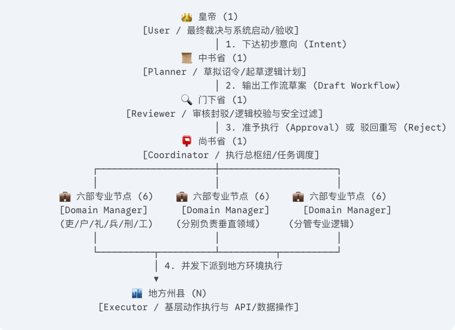

### 职责

| **部门 (唐代制度角色)**       | **MAS 节点职责 (核心功能)**                                                                       | **擅长领域 (节点专长与模型配置)**                                                   |
| --------------------- | ----------------------------------------------------------------------------------------- | ---------------------------------------------------------------------- |
| **👑 皇帝** *(最终裁决)*    | **定义初始需求与最终朱批验收 (User)。** 作为人类输入端，提供最高等级的指令。并在门下省核准、尚书省执行汇总后，进行最后的反馈确认。                   | **核心业务目标与伦理判断。** 人类用户节点，负责给系统定调并做最终把关。                                 |
| **📜 中书省** *(草拟诏令)*   | **任务规划与 Prompt 模版生成 (Planner)。** 哈里发的大脑。负责将皇帝的愿望转化为逻辑严密、可执行的“诏令草案”。                       | **复杂指令编写与结构化输出。** 由具备强推理能力的模型（如 GPT-4 / Claude 3.5）担任，擅长从 0 到 1 的逻辑编排。 |
| **🔍 门下省** *(审核封驳)*   | **逻辑安全护栏与异常拦截 (Reviewer)。** 专门对中书省生成的计划进行“挑刺”。如果发现计划违反规则或存在安全隐患，直接“封驳”（返回中书省重写）。          | **批判性审核与逻辑一致性检查。** 配置了严格合规性 System Prompt 的模型。擅长拦截错误、过滤幻觉和安全审查。        |
| **📮 尚书省** *(执行总枢纽)*  | **中央任务分发与状态流转 (Coordinator)。** 中枢执行机构。拿到合规的诏令后，负责解析并将其转化为六部可处理的专业子任务。                     | **并发管理与跨部门数据对齐。** 擅长高效调度，具备极强的“任务路由”和“执行监控”能力。                         |
| **💼 六部** *(分别执行)*    | **专业垂直领域的专家 Agent (Domain Expert)。** 每个部是一个独立的专家模块（如户部管财务 API、兵部管安全防护）。它们将子任务细化为可操作的终端指令。 | **垂直技能（财务/代码/法律/搜索等）。** 配置了对应领域专业知识库的专家 Agent，擅长解决具体的专业问题。             |
| **🏙️ 地方州县** *(落实终端)* | **高并发终端落实与物理操作 (Executor)。** MAS 的末梢。负责在具体的数据环境（州、县）中执行原子任务并收集真实反馈。                       | **原子操作与物理响应。** 响应极快的轻量化模型或代码脚本。擅长与真实环境进行 API 读写交互。                     |

## 中国周代分封制

### 拓扑图

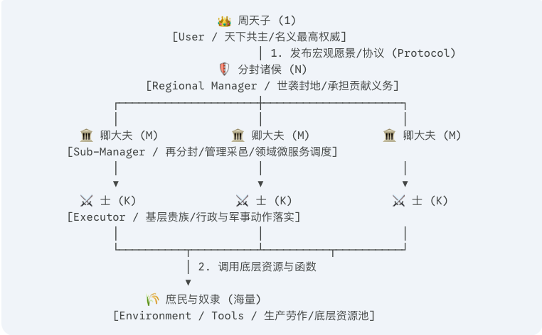

### 职责

| **部门 (周代制度角色)**       | **MAS 节点职责 (核心功能)**                                                                       | **擅长领域 (节点专长与模型配置)**                              |
| --------------------- | ----------------------------------------------------------------------------------------- | ------------------------------------------------- |
| **👑 周天子** *(天下共主)*   | **定义全局协议与名义验收 (User)。** 作为人类输入端，不直接干预地方运行。其职责是制定“礼乐制度”（全局通信协议），确保各节点在统一框架下运行。             | **共识算法与顶层设计。** 人类用户节点，负责维护系统的统一性和对齐准则。            |
| **🛡️ 分封诸侯** *(世袭封地)* | **分布式主控节点 (Regional Planner)。** 在自己的封地（子域）内拥有近乎绝对的规划权。它们定期向中央回传“贡献”（汇报日志/资源汇总），但内部逻辑完全自治。 | **高度自治的子系统管理。** 由具备强独立决策能力的模型担任。擅长在复杂局部环境下进行资源调配。 |
| **🏛️ 卿大夫** *(管理采邑)*  | **领域微服务调度 (Sub-Manager)。** 诸侯任务的进一步拆解者。在采邑（特定任务模块）内负责具体的流程控制和次级调度。                        | **细分领域的流程优化。** 擅长处理模块化的专业逻辑。                      |
| **⚔️ 士** *(基层贵族)*     | **原子动作执行者 (Executor)。** 负责行政与军事的具体操作。在 MAS 中，它们是执行 Function Calling 的最小智能单元。              | **精准指令遵循与物理操作。** 由轻量级、响应快的模型担任。擅长执行明确定义的单点任务。     |
| **🌾 庶民与奴隶** *(生产劳作)* | **被动资源层 (Environment/Tools)。** 在架构中是被操作的客体，负责提供基础的“劳作”（CPU 算力、数据库存储、API 原始响应）。            | **原始产出与基础计算。** 纯粹的物理工具或环境，无决策能力，仅负责执行和反馈。         |

## 西欧封建领主制

### 拓扑图

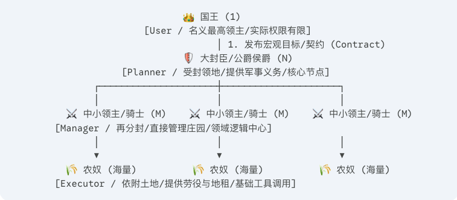

### 职责

| **部门 (西欧封建角色)**                | **MAS 节点职责 (核心功能)**                                                                          | **擅长领域 (节点专长与模型配置)**                                   |
| ------------------------------ | -------------------------------------------------------------------------------------------- | ------------------------------------------------------ |
| **👑 国王** *(实际权力有限)*           | **全局意图发布与名义共主 (User)。** 作为人类输入端，提供最高等级的“契约”和宏观方向。虽然拥有最高头衔，但无法越级指挥中小领主和农奴。                    | **基于协议的软性约束。** 人类用户节点，负责维护系统的整体框架和共识（Consensus）。       |
| **🛡️ 大封臣/公爵侯爵** *(受封领地/军事义务)* | **主控规划与资源抵押 (Planner)。** 接收国王的任务（契约），将其转化为自己领地内的具体行政计划。作为回报，向系统（国王）提供算力/资源（军事义务）支持。          | **强局部自治与契约管理。** 由具备高度逻辑自主性的模型担任。擅长在特定资源约束下独立完成工作流设计。   |
| **⚔️ 中小领主/骑士** *(再分封/直接管理庄园)*  | **领域执行调度与监工 (Manager)。** 大封臣任务的实际拆解者。它们直接控制庄园（特定的数据环境或函数库），负责将劳务指标分配给底层的执行者。                 | **战术执行与现场管理。** 由专家级 Agent 担任，擅长具体的操作细节和对基层节点的实时督导。     |
| **🌾 农奴** *(提供劳役与地租)*          | **基础数据生产与资源贡献 (Executor)。** MAS 的终端节点。它们直接“依附”于物理资源（土地），负责执行具体的 Function Calling，产出原始数据（地租）。 | **原子级任务执行与物理结果产出。** 由响应速度快、功能单一的轻量级模型或脚本组成。擅长死磕底层数据读写。 |

## 神圣罗马帝国

### 拓扑图

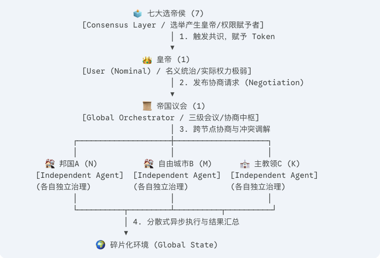

### 职责

| **部门 (神罗制度角色)**                    | **MAS 节点职责 (核心功能)**                                                                                 | **擅长领域 (节点专长与模型配置)**                                         |
| ---------------------------------- | --------------------------------------------------------------------------------------------------- | ------------------------------------------------------------ |
| **🗳️ 七大选帝侯** *(选举产生皇帝)*           | **权限管理与身份验证 (Auth Service / Consensus)。** 作为系统的“创世节点”，负责通过共识算法选举出皇帝。它们不干活，但握着系统的最高管理权（Admin Token）。 | **治理逻辑与准入控制。** 由具备高等级策略判断的模型担任，负责系统的稳定性维护。                   |
| **👑 皇帝** *(名义统治/实际权力极弱)*          | **名义上的全局调度器 (Nominal User/Scheduler)。** 由于实际权力极弱，他在 MAS 中更像是一个“请求协调员”。他发出指令，但不能强制执行，必须依赖下层的配合。      | **软性协调与指令翻译。** 由具备极强情商和沟通逻辑的模型担任。擅长在权力受限下寻求“最大公约数”。          |
| **📜 帝国议会** *(三级会议/协商)*            | **跨节点消息总线与冲突调解 (Service Bus / Mediator)。** 负责处理皇帝与数百个独立节点之间的复杂通信。它是系统的信息集散地，负责把不同利益方的需求进行对齐。        | **复杂协议对齐与长事务处理。** 由擅长多轮对话和复杂共识达成的 Planner 担任。                |
| **🏘️ 邦国 / 自由城市 / 主教领** *(各自独立治理)* | **完全自治的任务执行节点 (Independent Sub-system)。** 这是 MAS 的核心执行力。每个节点都是一个闭环的小系统，拥有自己的私有数据和执行逻辑，仅在必要时响应议会。    | **高度专业化与私有化任务。** 由各类异构模型担任（如有的管经济、有的管军事）。擅长在不受干扰的情况下处理本地化任务。 |

## 日本江户幕藩体制

### 拓扑图

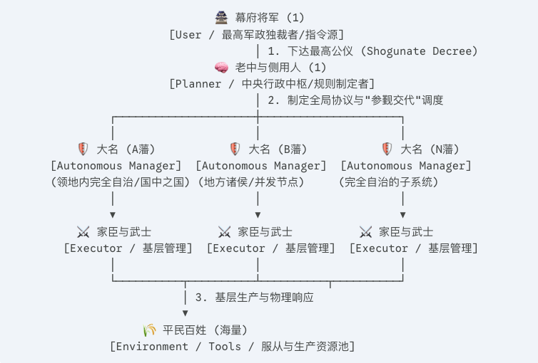

### 职责

| **部门 (幕藩体制角色)**          | **MAS 节点职责 (核心功能)**                                                                                 | **擅长领域 (节点专长与模型配置)**                                            |
| ------------------------ | --------------------------------------------------------------------------------------------------- | --------------------------------------------------------------- |
| **🏯 幕府将军** *(最高军政独裁者)*  | **定义全局稳定性与最高授权 (User)。** 作为人类输入端，决定“天下”的大方向。虽然名义受封于天皇（外部协议），但实际上是系统的绝对 Owner。                       | **战略威慑与核心准则设定。** 负责系统的终极对齐（Alignment）与资源最终分配。                   |
| **🧠 老中与侧用人** *(中央行政中枢)* | **全局规则编排与状态监控 (Planner)。** 哈里发的大脑。不直接管地方的琐事，但负责通过“参觐交代”机制，强制大名（Manager）定期回传运行数据（汇报）并进行物理位移（负载均衡测试）。 | **工作流编排与心跳机制设计。** 擅长利用复杂规则约束具有高自主性的子系统，确保它们不“离线”。               |
| **🛡️ 大名** *(地方诸侯/领地自治)* | **完全自治的领域主控 (Independent Manager)。** 真正的执行核心。在藩（子域）内拥有完整的行政、税收和司法权（国中之国）。它们是异构的，每个藩可以有自己的“土策略”。     | **异构子系统管理与局部最优决策。** 由具备高度私有化知识库的专家 Agent 担任。擅长在不依赖中央的情况下独立闭环运行。 |
| **⚔️ 家臣与武士** *(基层管理)*    | **任务落实与武力保障 (Executor)。** 负责将大名的指令转化为具体的行政动作。在 MAS 中，它们是执行特定 Function Calling 的专业单元。                | **精准执行与安全防护。** 由响应快、指令遵循度高的中型模型担任，负责维护局部系统的物理安全。                |
| **🌾 平民百姓** *(服从与生产)*    | **被动资源层与数据源 (Environment/Tools)。** 产出系统运行所需的“粮食”（Tokens/数据）。它们不参与决策，仅作为工具的响应环境存在。                   | **原始数据产出与基础计算负载。** 纯粹的物理工具或环境，负责提供系统运行的基础动能。                    |

## 阿兹特克三邦同盟

### 拓扑图

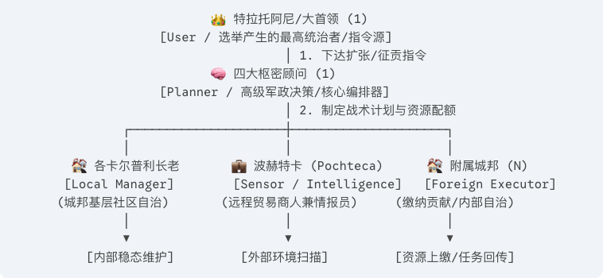

### 职责

| **部门 (阿兹特克角色)**           | **MAS 节点职责 (核心功能)**                                                                                                 | **擅长领域 (节点专长与模型配置)**                                                  |
| ------------------------- | ------------------------------------------------------------------------------------------------------------------- | --------------------------------------------------------------------- |
| **👑 特拉托阿尼** *(大首领)*      | **定义全局目标与最高权限授予 (User)。** 作为人类输入端，基于选举产生的合法性发布宏观指令。他的决定会改变整个集群的运行权重（如：从“生产模式”切换到“战争模式”）。                            | **战略决策与对齐标准设定。** 负责最高层级的价值观对齐。                                        |
| **🧠 四大枢密顾问** *(高级军政决策)*  | **核心执行规划与任务编排 (Planner)。** 大首领的大脑。负责将宏观指令转化为具体的军事部署和征贡指标。它是系统内唯一拥有全局视图的 Agent 组。                                    | **复杂战术推理与资源调度。** 由顶级推理模型担任，擅长处理多目标优化问题（Multi-objective Optimization）。 |
| **🏘️ 卡尔普利长老** *(基层社区自治)* | **内部资源管理与负载均衡 (Internal Manager)。** 负责维护系统内部（核心城邦）的稳定性。管理基础的生产单元，确保核心系统的资源供给不中断。                                    | **底层数据维护与局部自治。** 擅长在已知规则下管理内部的高并发任务。                                  |
| **💼 波赫特卡** *(远程商人/情报员)*  | **主动探测与动态环境扫描 (Active Sensor/Edge Agent)。** 系统里最灵活的 Agent。它们不仅携带资源（贸易），更重要的是**回传外部节点的隐藏信息**。如果附属城邦有异动，它们是第一个感知并反馈的。 | **情报分析与多模态感知。** 由擅长信息提取（Extraction）和环境扫描的 Agent 担任，作为系统延伸出去的“触角”。     |
| **🏘️ 附属城邦** *(保留内部自治)*   | **第三方服务/受限执行节点 (Foreign Executor)。** 这些节点不属于核心代码库，而是**通过接口（缴纳贡赋）连接的外部节点**。它们保留内部逻辑（自治），但必须响应核心系统的资源调用请求。            | **特定的功能输出。** 类似于外部 API。它们只根据协议输出特定的“贡赋”（数据/结果），内部逻辑对主系统透明。            |

## 雅典直接民主制

### 拓扑图

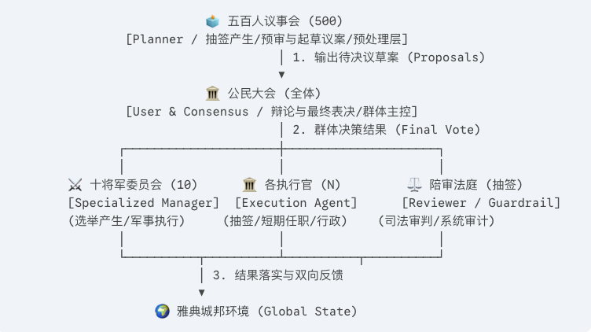

### 职责

| **部门 (雅典制度角色)**            | **MAS 节点职责 (核心功能)**                                                                                             | **擅长领域 (节点专长与模型配置)**                                    |
| -------------------------- | --------------------------------------------------------------------------------------------------------------- | ------------------------------------------------------- |
| **🏛️ 公民大会** *(全体男性公民)*    | **群体共识决策与最终主控 (User / Swarm Leader)。** 作为系统的最高权力源，通过群体辩论和投票产生最终结果。在 MAS 中，这相当于**多模型共识算法**，确保决策不被单一节点操控。         | **群体对齐与价值判定。** 人类用户群体节点，负责定义系统运行的最终边界。                  |
| **🗳️ 五百人议事会** *(预审与起草议案)* | **随机抽取的任务规划器 (Randomized Planner)。** 由于节点是通过抽签产生的，这保证了任务规划层具备极高的多样性。职责是预处理海量信息，提炼为可投票的布尔值或选项。                   | **预处理与议题生成。** 由动态抽取的模型实例担任。擅长从杂乱需求中提炼出结构化的工作流。          |
| **⚔️ 十将军委员会** *(军事执行)*     | **专业领域的持久化节点 (Expert Manager)。** 这是架构中极少数非抽签、而是选举产生的节点。在 MAS 中，处理高风险、强专业性（如安全防护、复杂基建）的任务时，需要**长效、专业化**的 Agent。  | **专业技能与高压决策。** 由具备特定专业领域知识的顶级大模型担任。擅长在复杂动态环境下快速反应。      |
| **⚖️ 陪审法庭** *(司法审判)*       | **随机分布的审计护栏 (Swarm Reviewer)。** 同样通过抽签产生，负责对执行官和将军的行为进行“追溯审计”。这是一种强大的 **Guardrail（护栏）** 机制，确保任何节点违法必被检出。        | **异常检测与行为审计。** 通过大规模平行验证（Cross-validation）来检测系统中的腐败或错误。 |
| **🏛️ 各执行官** *(日常行政)*      | **短期轮岗的原子执行者 (Ephemeral Executor)。** 负责最基础、最琐碎的行政任务。由于任期短且随机抽签，它们在 MAS 中属于**临时容器（Ephemeral Containers）**，干完即销毁。 | **标准化流程执行。** 由成本极低的小模型（Flash 类）担任，负责按照议事会确定的流程进行打工。     |

## 古斯巴达寡头与民主混合制

### 拓扑图

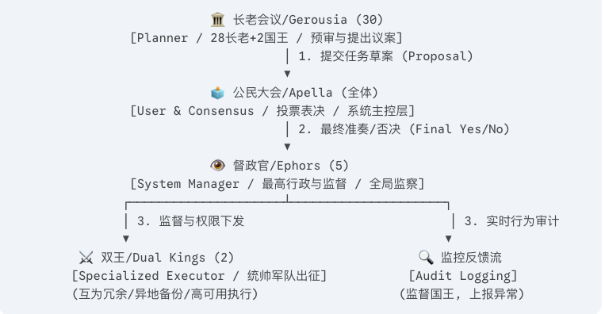

### 职责

| **部门 (斯巴达制度角色)**          | **MAS 节点职责 (核心功能)**                                                                                         | **擅长领域 (节点专长与模型配置)**                                               |
| ------------------------- | ----------------------------------------------------------------------------------------------------------- | ------------------------------------------------------------------ |
| **🗳️ 公民大会** *(年满30岁公民)*  | **决策层与最终权限控制 (User)。** 作为人类介入层，拥有对议案的最终表决权。它不参与写代码，但决定哪些代码（计划）可以跑起来。                                        | **核心价值判定与对齐校验。** 负责定义系统运行的布尔结果（Accept / Reject）。                   |
| **🏛️ 长老会议** *(28长者+2国王)* | **前置规划与工作流生成 (Planner)。** 系统中经验最丰富的“元老”节点。负责从海量复杂需求中提炼出可被公民大会理解的结构化议案。                                      | **长上下文逻辑编排与稳定性设计。** 由具备高推理能力的模型组成，擅长在历史记录（传统）基础上规划新任务。             |
| **👁️ 督政官** *(5人/最高行政)*   | **系统管理与动态审计 (System Manager/Reviewer)。** 拥有最高行政权，不仅负责日常调度，更重要的是对“双王”和“长老”进行实时监控，防止节点越权。                     | **实时行为监测与安全合规。** 配置了顶级合规 Prompt 的 Agent。擅长捕捉异常行为（如国王叛乱/逻辑偏见）并强制中断。 |
| **⚔️ 双王** *(统帅军队出征)*      | **双机热备的专项执行器 (Specialized Executor)。** 这是最精彩的部分。双王制代表了 **“1+1”冗余备份**：两个独立的执行 Agent，一个出征时，另一个可以在后方或同时在场提供互校。 | **高压环境下的专业执行。** 专注军事（特定工具集调用）。两个 Agent 互为镜像，确保在复杂的“战场环境”中具备极高的容错率。 |

## 罗马共和国混合立宪制

### 拓扑图

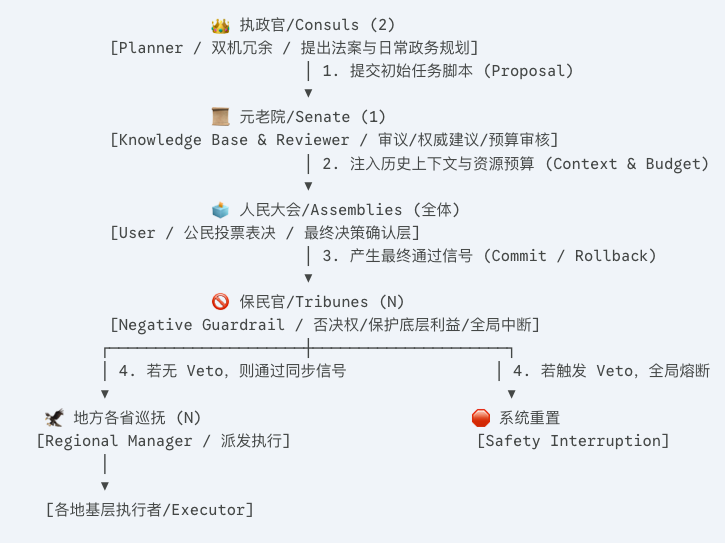

### 职责

| **部门 (罗马共和国角色)**        | **MAS 节点职责 (核心功能)**                                                                                  | **擅长领域 (节点专长与模型配置)**                                       |
| ----------------------- | ---------------------------------------------------------------------------------------------------- | ---------------------------------------------------------- |
| **👑 执政官** *(2人)*       | **双机热备的 Planner (Redundant Planner)。** 负责生成初始的工作流建议。双人配置意味着系统具备高可用性，两个 Planner 可以互相校验或分担政务与军事逻辑。     | **高层规划与实时政务处理。** 由顶级推理模型担任，擅长从 0 到 1 构建任务框架。               |
| **📜 元老院** *(审议/建议/预算)* | **长程记忆与专家审议 (Expert Reviewer)。** 作为系统的“外部知识库（RAG）”，提供关于传统、外交和预算的专业建议。它们不直接投票，但能显著影响计划的权重。            | **历史上下文检索与财政预算优化。** 拥有庞大的数据库访问权限，擅长进行复杂的成本/收益分析。           |
| **🗳️ 人民大会** *(公民投票)*   | **系统终极共识层 (User / Final Consensus)。** 这是 MAS 的主控端。任何 Planner 提出的方案，必须在此获得“Commit”信号才能进入执行阶段。         | **核心业务对齐与投票算法。** 代表人类用户的利益，负责对输出方案进行最后的价值判定。               |
| **🚫 保民官** *(否决权/Veto)* | **独立的安全护栏 (Global Guardrail)。** 这是罗马制度的灵魂。保民官拥有 `sys_interrupt` 权限，只要检测到计划损害了底层节点（平民）的利益，可以一键终止整个流程。 | **异常检测与利益一致性校验。** 专注于检测潜在风险。这是一个单向的逻辑门：平时不说话，一旦说话就是“Stop”。 |
| **🦅 地方各省巡抚** *(派发执行)*  | **地域路由与任务派发 (Regional Manager)。** 将通过审核且未被否决的法案（指令）翻译为各省的局部操作，并监控下层执行者的进度。                           | **大规模分布式调度。** 擅长跨地域的同步执行和局部资源的动态平衡。                        |

## 英国议会君主制

### 拓扑图

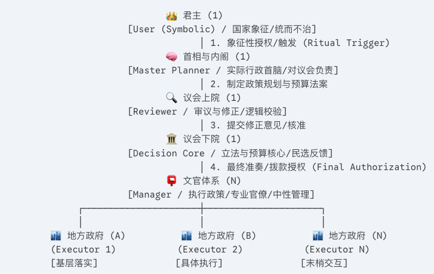

### 职责

| **部门 (英国制度角色)**          | **MAS 节点职责 (核心功能)**                                                                         | **擅长领域 (节点专长与模型配置)**                              |
| ------------------------ | ------------------------------------------------------------------------------------------- | ------------------------------------------------- |
| **👑 君主** *(统而不治)*       | **系统启动符号与协议守卫 (Symbolic User)。** 作为名义上的最高层，不参与任何实际计算。其职责是提供系统的“合法性”标识（Token），标志着任务流正式开启。    | **协议一致性与形式对齐。** 负责维护系统的长期品牌和全局稳定。                 |
| **🧠 首相与内阁** *(实际行政首脑)*  | **核心策略生成与规划 (Master Planner)。** 系统真正的运行大脑。负责将复杂的社会需求转化为可执行的行政政策。它必须对下院（反馈层）实时负责。            | **动态规划与资源平衡。** 由具备最高级别推理能力的大模型担任，擅长制定复杂的多阶段计划。    |
| **🔍 议会上院** *(审议与修正)*    | **逻辑优化与异常审查 (Reviewer)。** 对 Planner 生成的草案进行细化检查和优化建议。它可以延缓决策执行以进行更深层的风险评估。                  | **深度分析与合规性微调。** 配置了大量历史数据和法律逻辑的专家模型，擅长挑出计划中的细微漏洞。 |
| **🏛️ 议会下院** *(立法与预算核心)* | **最终决策点与资源分配器 (Decision Core/Guardrail)。** 它是系统的“过滤器”，掌握着最核心的算力资源（预算）。如果计划无法通过下院，任务流将被强制终止。 | **群体意图解析与价值对齐。** 通过大规模平行表决实现共识，确保输出结果符合广大用户的原始预期。 |
| **📮 文官体系** *(执行政策)*     | **专业流程管理与状态保持 (Manager)。** 这是系统中最稳定的部分。无论上面的 Planner（内阁）如何更替，文官 Agent 始终保持政策执行的专业性和连续性。     | **标准化流程管理与专业行政。** 擅长管理海量并发任务，确保不同政府周期间的数据一致性。     |
| **🏙️ 地方政府** *(基层落实)*    | **区域终端执行与物理操作 (Executor)。** 真正的打工人。负责在特定的地域分区执行具体的 API 动作，并将最底层的环境反馈逐级上传。                   | **本地化适配与原子动作执行。** 由响应速度快、擅长单一地域环境交互的小模型担任。        |

## 美国联邦总统制

### 拓扑图

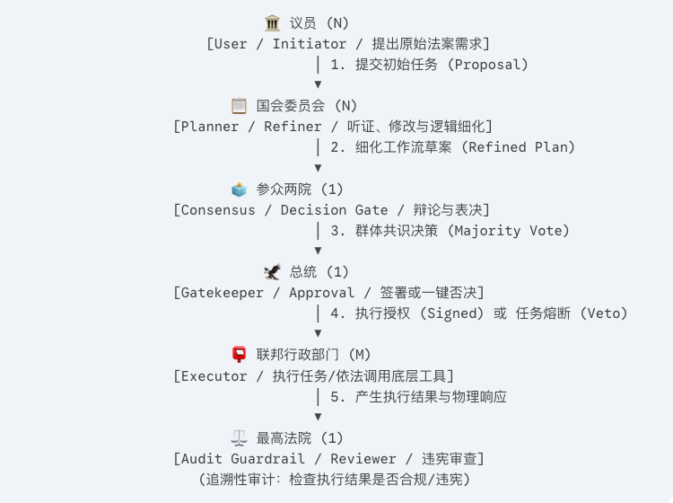

### 职责

| **部门 (美国制度角色)**        | **MAS 节点职责 (核心功能)**                                                                                      | **擅长领域 (节点专长与模型配置)**                                                |
| ---------------------- | -------------------------------------------------------------------------------------------------------- | ------------------------------------------------------------------- |
| **🏛️ 议员** *(提出法案)*    | **任务发起与初始意图定义 (Initiator)。** 作为系统的输入端（可以是人类或特定的上游 Agent），负责提出“法案建议”。它定义了系统运行的初始动力。                       | **业务需求获取与抽象。** 擅长将原始痛点转化为标准的消息请求。                                   |
| **📋 国会委员会** *(听证与修改)* | **需求细化与专家评审 (Planner/Refiner)。** 根据专业领域（如财政、科技）进行预处理。通过“听证”模拟各方反馈，对任务进行反复修补，输出高质量的可执行方案。                 | **专业领域的逻辑打磨。** 配置了对应垂直领域知识库的 Agent。擅长将模糊需求转化为精细化的 JSON 工作流。         |
| **🗳️ 参众两院** *(辩论与表决)* | **逻辑对齐与群体决策 (Consensus Gate)。** 这是系统的第一个“过滤器”。通过多个模型（代表不同立场）的模拟辩论和投票，确保方案不具备单一点的逻辑偏见。                    | **群体智能与偏见检测。** 利用多模型一致性（Self-Consistency）技术，确保方案经过了多维度的压力测试。        |
| **🦅 总统** *(签署或否决)*    | **最终审批与执行门控 (Final Gatekeeper)。** 系统的最高行政负责人。它拥有一票否决权（Veto）。它的职责是根据全局利益决定是否允许任务进入昂贵的“行政执行”环节。            | **全局利益权衡与任务熔断。** 由具备最高控制权的大模型担任。擅长在执行前进行最后的安全性确认。                   |
| **📮 联邦行政部门** *(依法执行)* | **多线程任务落地与工具调用 (Executor)。** 真正的打工人。负责将签署的法案落实到具体的物理动作中（如 API 请求、文件写入）。各部门之间高度并行。                        | **大规模并发执行与环境交互。** 由高效、专注的 Action Agent 组成。擅长死磕特定的行政任务。              |
| **⚖️ 最高法院** *(违宪审查)*   | **终极合规性审计与护栏 (Audit Guardrail)。** 这是架构的“补救层”。即使总统和国会都通过了，如果执行结果违反了核心协议（宪法），最高法院可以将其判定为无效（Null and Void）。 | **核心价值观对齐与违宪检测。** 配置了系统最底层法律/协议约束的 Reviewer Agent。擅长对已完成的任务进行追溯性审计。 |

## 蒙古帝国札撒与汗国制

### 拓扑图

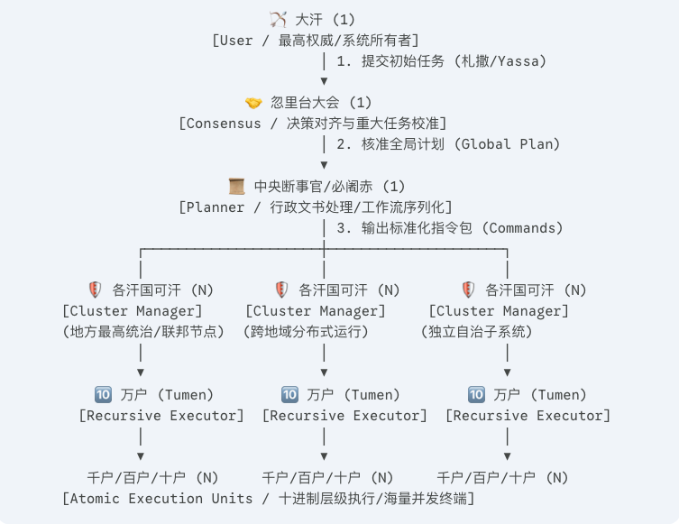

### 职责

| **部门 (蒙古制度角色)**             | **MAS 节点职责 (核心功能)**                                                                          | **擅长领域 (节点专长与模型配置)**                                             |
| --------------------------- | -------------------------------------------------------------------------------------------- | ---------------------------------------------------------------- |
| **👑 大汗** *(最高权威)*          | **全局愿景定义与系统主控 (User)。** 作为人类输入端，基于“札撒”（大典）发布最终指令。它定义了系统的“对齐（Alignment）”终点，即帝国的统一扩张方向。        | **战略意图与最高权限管理。** 人类用户节点，负责提供核心 Prompt。                           |
| **🤝 忽里台大会** *(重大决策/推举)*    | **群体共识与治理层 (Consensus Layer)。** 负责对重大任务进行“投票过滤”。在 MAS 中，这确保了 Planner 生成的计划符合“黄金家族”（核心协议）的利益。 | **多智能体共识与冲突协调。** 由多个高权重节点组成的评审组，负责任务的合法性校验。                      |
| **📜 中央断事官/必阇赤** *(行政文书处理)* | **工作流编排与文档自动化 (Planner/Orchestrator)。** 系统的“首席技术官”。负责将口头圣旨转化为精确的文书记录，并拆解为标准化指令下派。            | **高精度解析与文书自动化。** 擅长将非结构化数据转化为结构化的 JSON/指令流，确保信息传递零偏差。            |
| **🛡️ 各汗国可汗** *(地方最高统治)*    | **分布式集群管理者 (Cluster Manager)。** 蒙古帝国的分布式节点。每个汗国都是一个独立的算力中心，但在“札撒”协议下通过主系统协同。                 | **异构环境下的局部统治。** 配置了独立资源池的专家 Agent。擅长在不同地域（如金帐汗国、伊利汗国）进行本地化执行。    |
| **🔟 十进制军政单位** *(万/千/百/十户)* | **递归式标准化执行 (Recursive Executors)。** 这是系统最强悍的地方。每一级都是下一级的复制，实现了 **1对10 的线性扩展**。无论规模多大，逻辑完全一致。 | **大规模高并发原子执行。** 由无数响应极快的轻量级节点（Worker）组成。擅长死磕单一动作，通过数量级优势产生爆发性效果。 |

## 印加帝国米塔劳役制

### 拓扑图

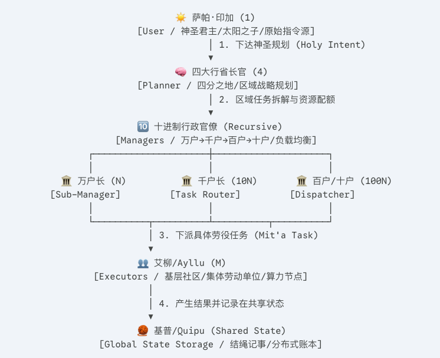

### 职责

| **部门 (印加制度角色)**              | **MAS 节点职责 (核心功能)**                                                                                              | **擅长领域 (节点专长与模型配置)**                              |
| ---------------------------- | ---------------------------------------------------------------------------------------------------------------- | ------------------------------------------------- |
| **☀️ 萨帕·印加** *(最高君主)*        | **最高意志定义与神权对齐 (User)。** 提供顶层 Prompt。由于没有货币，其职责是定义资源分配的优先级（如：先建路还是先存粮）。                                           | **终极业务逻辑与对齐（Alignment）。** 负责维护系统运行的神圣性和长期稳定性。     |
| **🧠 四大行省长官** *(四分之地)*       | **区域化多模态规划 (Regional Planner)。** 将总任务按东南西北（四个 Suyu）进行分流。这是系统的一级路由，负责地理/领域维度的初步负载均衡。                              | **宏观战略拆解与资源平衡。** 由顶级推理模型担任，擅长在大尺度环境下进行任务调度。       |
| **🔟 十进制行政官僚** *(万/千/百/十户长)* | **递归式任务颗粒度化 (Recursive Managers)。** 类似于蒙古制的递归，但在印加体制下，它们不仅管人，更管“配给”。它们负责精确计算每个节点的任务量和所需“福利（Food/Tool）”。          | **精准的配额计算与任务分流。** 由具备强数学逻辑的模型担任，确保任务层层向下，不产生数据丢失。 |
| **👥 艾柳/Ayllu** *(基层社区)*     | **容器化集体执行单元 (Collective Executor)。** 这是 MAS 的最小执行单元，但它是**“容器化”**的。一个 Ayllu 作为一个整体响应任务，内部通过协作完成具体的 Function Call。 | 协同式原子任务执行。 擅长在受限环境下完成具体的基建、耕作或搬运任务，并返回执行报告。       |
| 🧶 基普 (Quipu) *(结绳记事)*       | 分布式状态存储与持久化 (Shared Metadata)。 这是架构最特殊的部分。在没有文字（Code）的系统里，它是唯一的**全局状态字典**。所有的任务进度、人口、库存全记录在此。                    | **结构化数据记录与持久化。** 它是系统的“非易失性内存”，所有节点读写该账本以保持同步。    |

## 原始部落酋邦制

### 拓扑图

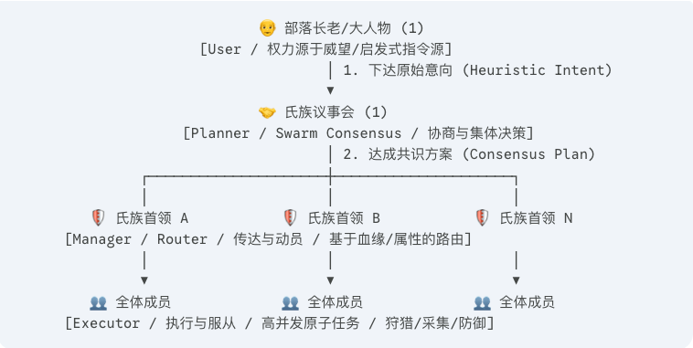

### 职责

| **部门 (原始制度角色)**          | **MAS 节点职责 (核心功能)**                                                                            | **擅长领域 (节点专长与模型配置)**                                               |
| ------------------------ | ---------------------------------------------------------------------------------------------- | ------------------------------------------------------------------ |
| **👴 部落长老/大人物** *(最高权威)* | **启发式任务发起与价值对齐 (User)。** 作为人类输入端，基于“经验（即历史语料数据）”发布初始指令。由于没有成文法，其职责是确保系统运行符合部落的生存直觉。            | **模糊需求定义与长期记忆。** 负责提供系统的初始 Prompt。其权威来自“历史长连接（Long-term Context）”。 |
| **🤝 氏族议事会** *(协商与集体决策)* | **基于群体智能的共识规划 (Swarm Planner)。** 这是系统的大脑。通过多个模型实例（各氏族代表）之间的辩论和加权，将长老的模糊意图转化为可执行的共识计划。          | **多模型协商与逻辑去偏。** 擅长在没有硬性规则（法律）的情况下，通过投票或权重衰减达成一致。                   |
| **🛡️ 氏族首领** *(传达与动员)*   | **基于亲和性的任务路由 (Affinity Router)。** 这是系统的分发层。根据“血缘（即数据标签/属性）”将共识任务路由给特定的成员组，负责任务的本地化动员。          | **领域/标签分发与状态激励。** 擅长管理特定子群体的生命周期，确保子系统对上层计划的高响应度。                  |
| **👥 全体成员** *(执行与服从)*    | **全员高并发执行 (Massive Executor)。** 真正落地干活的终端。在 MAS 中，这代表所有活跃的执行 Agent。它们接收首领指令，在物理环境（大自然）中完成原子操作。 | **高效率交互与基础函数执行。** 由响应速度快、功能基础的小模型组成。擅长死磕单一的生产或安全任务。                |

## 易洛魁联盟

### 拓扑图

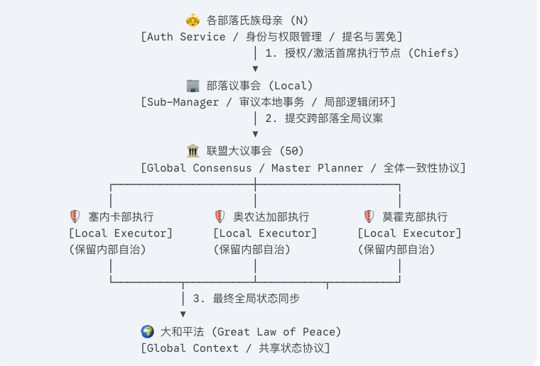

### 职责

| **部门 (易洛魁制度角色)**           | **MAS 节点职责 (核心功能)**                                                                                            | **擅长领域 (节点专长与模型配置)**                                  |
| -------------------------- | -------------------------------------------------------------------------------------------------------------- | ----------------------------------------------------- |
| **👵 各部落氏族母亲** *(提名/罢免)*   | **权限管理与安全审计 (Auth & Identity Agent)。** 作为系统的“根用户”或权限层。她们不参与具体干活，但握着节点的“启动开关（Nominate）”和“下线开关（Remove）”。         | **身份验证与健康度监控。** 擅长监控子节点（酋长）的表现，若逻辑跑偏，立即吊销其 Token。     |
| **🏢 部落议事会** *(审议本部事务)*    | **局部子系统规划 (Sub-system Planner)。** 处理高度私有的本地逻辑。只有在需要跨系统协作时，才会将请求上报给全局层。                                         | **局部最优决策与领域内聚。** 由垂直领域专家模型担任，负责维护本地状态一致性。             |
| **🏛️ 联盟大议事会** *(50名酋长协商)* | **高等级共识引擎 (Master Planner / Consensus Layer)。** 由 50 个高权重节点组成。最核心特性是 **Unanimity（全员一致）**，即只要有一个节点“反对”，计划就不能通过。 | **复杂博弈与零容忍合规。** 由推理深度极高的模型集群担任。擅长解决长程决策，通过多轮对话达成完全对齐。 |
| **🛡️ 各部落执行** *(执行指令)*     | **分布式执行器 (Distributed Executor)。** 即使在联盟决策下，各部依然保留内部自治逻辑。在 MAS 中，这意味着执行层具备很强的**抗压性**和**独立运行能力**。               | **并行处理与本地环境适配。** 由异构模型担任，擅长将全局指令翻译为适合本地资源的原子操作。       |

## 苏美尔城邦制

### 拓扑图

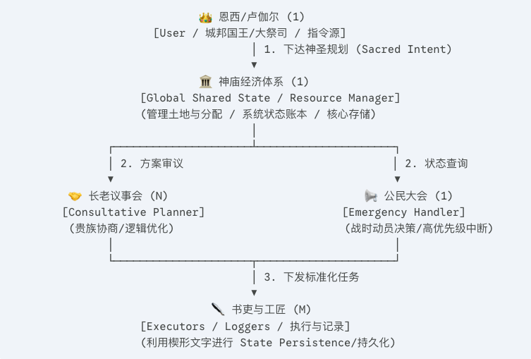

### 职责

| **部门 (苏美尔制度角色)**           | **MAS 节点职责 (核心功能)**                                                                      | **擅长领域 (节点专长与模型配置)**                                |
| -------------------------- | ---------------------------------------------------------------------------------------- | --------------------------------------------------- |
| **👑 恩西/卢伽尔** *(城邦国王/大祭司)* | **意图定义与最高权限管理 (User)。** 作为人类输入端，代表“神的意志”发布指令。在 MAS 中，它负责设定系统的初始 Prompt 和终极边界。            | **战略导向与神圣对齐 (Alignment)。** 负责维护系统运行的合法性与宏观方向。       |
| **🏛️ 神庙经济体系** *(管理土地与分配)* | **集中式资源调度与共享状态 (Shared State/RAG)。** 这是苏美尔架构的灵魂。所有土地（存储）和产出（计算资源）都归神庙。                   | **资源配额管理与数据持久化。** 作为系统的“真理来源”，管理所有 Agent 的上下文与资产状态。 |
| **🤝 长老议事会** *(贵族协商)*      | **逻辑优化与逻辑微调 (Logic Refiner)。** 对恩西的意图进行可行性分析。在 MAS 中，这是一组具有高权重的专家模型，负责修正 Planner 的逻辑偏差。  | **复杂博弈与规则细化。** 擅长在现有资源约束下，通过对话协商达成次优解。              |
| **📢 公民大会** *(战时动员决策)*     | **高优先级事件处理器 (Global Interrupter)。** 平时不活跃，但在面临“战争（突发高负载或外部攻击）”时激活。拥有改变系统运行模式的权力。         | **异常处理与大规模动员。** 负责在紧急情况下强制重置所有 Worker 的优先级。         |
| **✒️ 书吏与工匠** *(执行与记录)*     | **原子执行与日志持久化 (Executor / Persistence Agent)。** 书吏负责记录（楔形文字即日志），工匠负责干活。这是系统产出结果并写入数据库的终端。 | **结构化输出与 Function Calling。** 擅长将执行结果转化为标准化的持久化记录。   |

## 马里帝国曼丁卡治理制

### 拓扑图

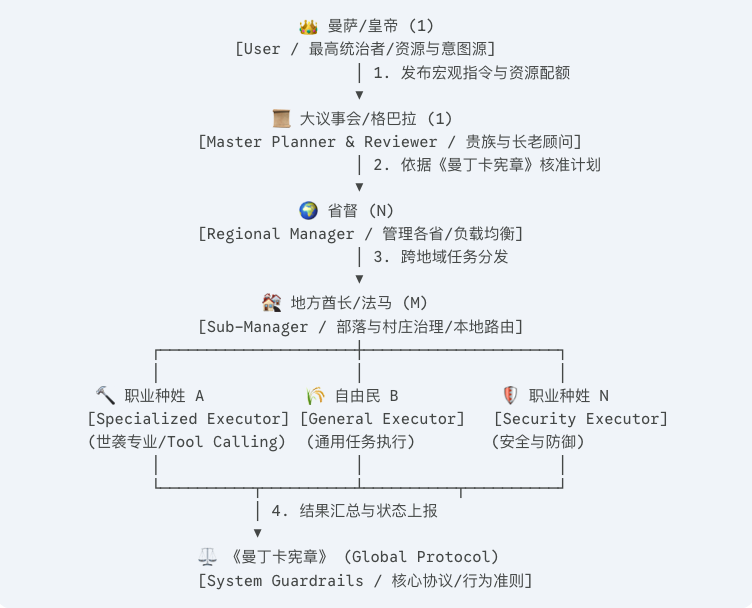

### 职责

| **部门 (马里制度角色)**                   | **MAS 节点职责 (核心功能)**                                                                                        | **擅长领域 (节点专长与模型配置)**                                                |
| --------------------------------- | ---------------------------------------------------------------------------------------------------------- | ------------------------------------------------------------------- |
| **👑 曼萨 (Mansa)** *(最高统治者)*       | **最高意志定义与资源注入 (User)。** 作为人类输入端，提供最高等级的 Prompt。其特点是拥有“极高的黄金储备（即 Token 预算）”，负责定义系统的终极目标。                    | **全局愿景与大规模资源管理。** 人类用户节点，负责系统的对齐（Alignment）方向。                      |
| **📜 格巴拉 (Gbara)** *(大议事会)*       | **集体共识规划与逻辑修正 (Master Planner)。** 由各界长老组成。它不是单点决策，而是通过群体智能（Swarm Intelligence）将曼萨的意向转化为符合《曼丁卡宪章》的可执行政策。    | **复杂博弈与契约合规。** 由多个高推理能力模型组成的 Agent 集群。擅长在传统逻辑与伊斯兰行政经验间寻找平衡。         |
| **🌍 省督** *(管理各省)*                | **一级地域分发层 (Regional Manager)。** 负责将中央政策路由至不同的地理分区（省）。它在这一层级进行初步的任务过滤，确保资源不被浪费。                             | **区域调度与宏观监控。** 擅长在分布式环境下维持区域状态的一致性。                                 |
| **🏘️ 地方酋长/法马** *(村庄治理)*          | **二级局部调度层 (Sub-Manager)。** 最贴近执行端的节点。负责根据本地部落的实际情况（本地知识库 RAG），对任务进行最后的微调和下发。                               | **本地化适配与细粒度管理。** 擅长处理非结构化的本地环境反馈。                                   |
| **🔨 职业种姓** *(世袭职业/生产服务)*         | **专业领域工具调用器 (Specialized Executor)。** 这是架构中最具特色的地方。任务被分配给“世袭”的节点，意味着这些 Agent **硬编码了特定领域的专业技能**（如铁匠、乐师、史官）。 | **垂直领域 Function Calling。** 由配置了专用工具集（Tools）的模型担任，执行精度极高，具备极强的领域确定性。 |
| **⚖️ 《曼丁卡宪章》** *(Manden Charter)* | **系统核心协议与硬护栏 (System Protocol)。** 规定了“废除奴隶制、个人自由”等核心逻辑。如果任何节点的输出违反了此协议，将被系统强制拦截。                           | **底层安全规则与伦理对齐。** 作为整个 MAS 的基石协议，确保 AI 行为的边界安全。                      |

## 8. 奥斯曼帝国御前会议制

### 拓扑图

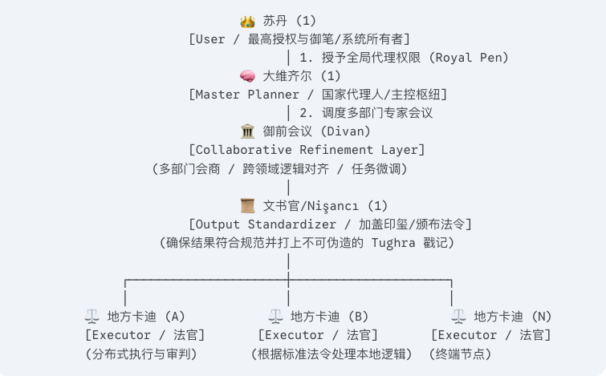

### 职责

| **部门 (奥斯曼制度角色)**         | **MAS 节点职责 (核心功能)**                                                                                   | **擅长领域 (节点专长与模型配置)**                                          |
| ------------------------ | ----------------------------------------------------------------------------------------------------- | ------------------------------------------------------------- |
| **👑 苏丹** *(最高授权)*       | **最终结果审批与权力底座 (User)。** 作为人类输入端，苏丹不干预日常 Task，但掌握“御笔（Signature）”。他是整个 MAS 的根信任源，只有盖了他的印（Tughra）系统才算闭环。 | **战略对齐与系统重启。** 负责定义系统的价值观与终极安全边界。                             |
| **🧠 大维齐尔** *(Sadrazam)* | **全权代理规划器 (Master Planner)。** 哈里发的大脑。他是系统的单一入口点（Single Point of Entry），负责解析苏丹的模糊愿景并指挥后续所有节点。          | **高层管理逻辑与资源统筹。** 由具备最大上下文窗口和最强逻辑推理的模型担任，负责管理所有子 Agent 的生命周期。  |
| **🏛️ 御前会议** *(Divan)*   | **专家协作与逻辑对齐 (Expert Mixture)。** 这不是一个单点模型，而是一个由财政、军事、行政等垂直领域专家（Viziers）组成的 Agent 集群。                  | **跨领域冲突检测与协同规划。** 擅长在不同业务逻辑之间寻找平衡点，输出多维度完善的计划。                |
| **📜 文书官** *(Nişancı)*   | **输出标准化与印玺保护 (Formatter/Guardrail)。** 非常关键的节点。负责将会议结果转化为标准化的法令格式，并加盖专属印章。                             | **格式化输出与内容防伪。** 擅长 JSON/XML 等标准化格式转化，确保指令在传输过程中不产生歧义。         |
| **⚖️ 地方卡迪** *(Qadi)*     | **分布式执行与环境感知 (Field Executor)。** 系统的末梢执行者。他们不仅执行命令，还具备“审判（本地判断逻辑）”能力，能根据当地环境对指令进行弹性处理。                | **本地化逻辑执行与工具调用。** 由响应速度快、擅长单一职责（Single Responsibility）的小模型担任。 |

## 苏联共产党-国家体制

### 拓扑图

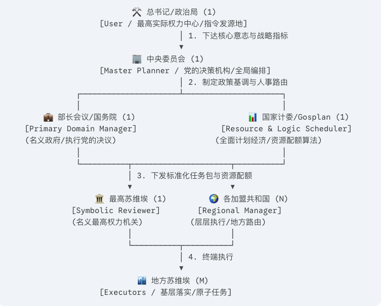

### 职责

| **部门 (苏联制度角色)**                  | **MAS 节点职责 (核心功能)**                                                                                           | **擅长领域 (节点专长与模型配置)**                                             |
| -------------------------------- | ------------------------------------------------------------------------------------------------------------- | ---------------------------------------------------------------- |
| **⚒️ 总书记/政治局** *(最高权力中心)*        | **定义全局 Prompt 与终极审核 (User)。** 作为系统的最高启动端。所有的输出结果必须绝对符合其初始定义的“意识形态（对齐准则）”。拥有对所有节点的一键重置（Purge）权限。               | **战略对齐（Alignment）与意志贯彻。** 负责人机对齐的最高维度。                           |
| **🏢 中央委员会** *(党的决策机构)*          | **全局工作流编排器 (Master Planner)。** 负责将政治局的战略意图转化为具体的政策指令。它管理着整个系统的“人事（Node Selection）”和“组织（Topology）”。            | **复杂逻辑拆解与节点管理。** 由具备极强统筹能力的大模型担任，擅长处理超长上下文的任务分发。                 |
| **📊 国家计委 (Gosplan)** *(全面计划经济)* | **全局资源平衡与数学调度 (Resource Scheduler)。** 这是架构中技术含量最高的部分。负责计算全系统的 Token 分配、算力调度和时间片分配。所有的执行必须先由计委进行“配额（Quota）”确认。 | **多维数据对齐与精确配额算法。** 擅长处理复杂的资源分配（Constraint Satisfaction Problem）。 |
| **💼 部长会议/国务院** *(名义政府)*         | **主要业务领域管理者 (Primary Domain Manager)。** 负责日常政务（API/业务逻辑）的正常运转。它在逻辑上从属于党，但在行政执行上是系统的第一负责人。                     | **标准化行政管理与 API 调用。** 负责将计委的配额转化为具体的任务执行序列。                       |
| **🏛️ 最高苏维埃** *(名义最高权力)*         | **名义上的 Reviewer / 记录器 (Logger)。** 这是一个被“逐步虚化”的节点。它的职责是给已经做出的决策进行“盖章（Commit）”，并在形式上对结果进行公示，其实际干预能力极低。          | **静态日志记录与形式化校验。** 类似于系统的“名义输出端口”，负责输出最后的标准化文档。                   |
| **🌍 各加盟共和国** *(层层执行)*           | **分布式地域调度层 (Regional Manager)。** 负责在具体的物理分区落实计划。每一个加盟共和国都是一个受控的子系统，通过统一的接口（苏维埃架构）与主系统连接。                      | **局部环境下的指令贯彻。** 擅长在局部环境下处理高并发的任务接收。                              |

## 欧洲联盟超国家治理体制

### 拓扑图

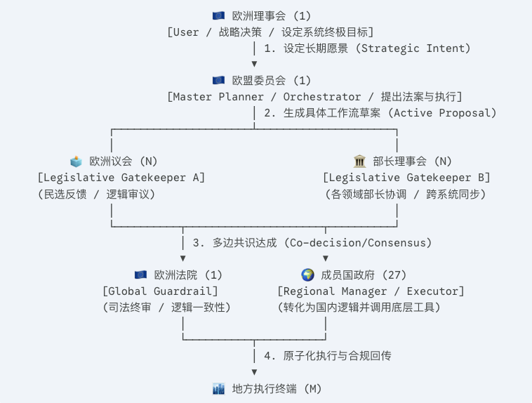

### 职责

| **部门 (欧盟制度角色)**            | **MAS 节点职责 (核心功能)**                                                                                      | **擅长领域 (节点专长与模型配置)**                                         |
| -------------------------- | -------------------------------------------------------------------------------------------------------- | ------------------------------------------------------------ |
| **🇪🇺 欧洲理事会** *(战略方向)*    | **最高战略意图定义 (User)。** 作为人类输入端，由各国首脑组成，不处理技术细节。其职责是定义系统在未来数个周期内的核心对齐（Alignment）方向（如“碳中和”、“数字化转型的 Prompt”）。 | **宏观愿景与多目标平衡。** 负责确定系统的大方向和最高优先级。                            |
| **🇪🇺 欧盟委员会** *(行政/提出法案)* | **核心任务编排器 (Master Planner)。** 系统的“发动机”。负责起草具体的执行计划（法案），并管理系统的日常运行状态。它是唯一拥有“立法倡议权”的节点。                    | **跨领域逻辑编排与任务生命周期管理。** 由具备顶尖推理能力的大模型担任，擅长将宏观愿景转化为细化的 JSON 指令。 |
| **🗳️ 欧洲议会** *(共同立法/民选)*   | **外部意图对齐层 (User Feedback Reviewer)。** 代表“用户侧（公民）”的利益。对 Planner 生成的计划进行伦理、社会影响和用户体验维度的压力测试。               | **多元价值校验与用户意图对齐。** 擅长检测计划是否违反了预设的社会规范或用户偏好。                  |
| **🏛️ 部长理事会** *(共同立法/协调)*  | **成员节点一致性协议 (Consensus Layer)。** 确保超国家指令在不同成员节点（国家）之间具备可协调性。通过多轮对话，解决不同子系统之间的资源冲突。                       | **跨节点通信协议与负载对齐。** 由具备极强平衡逻辑的 Agent 担任。                       |
| **🌍 成员国政府** *(转化为国内法执行)*  | **本地化适配与路由 (Regional Manager)。** 关键的“适配层”。负责将超国家指令（Directives）翻译成适合本地数据环境和法律逻辑的本地代码并执行。                  | **本地知识库 RAG 与环境适配。** 擅长在保持全局一致性的同时，处理极其复杂的本地变量。              |
| **🇪🇺 欧洲法院** *(司法终审)*     | **终极合规性护栏 (Global Guardrail)。** 拥有对系统底层协议（Treaties）的最终解释权。任何节点（包括欧盟委员会和成员国）的输出如果违宪，将被其一键强制撤销。            | **形式逻辑验证与终极对齐审计。** 配置了系统最底层法律条约知识库的 Reviewer，确保所有操作“师出有名”。   |
