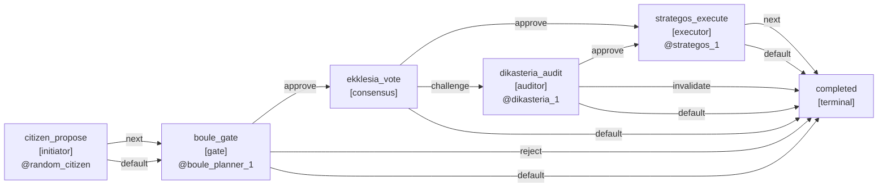
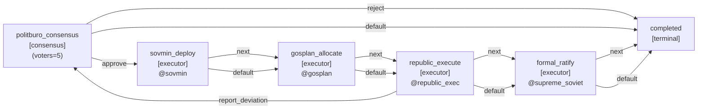
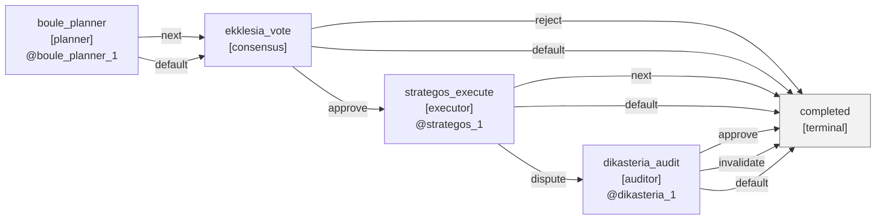
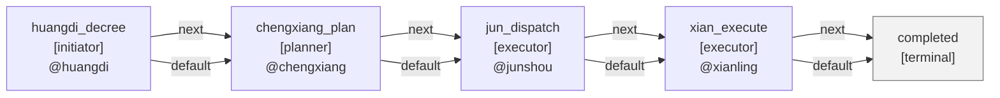
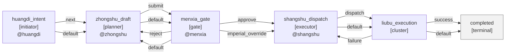
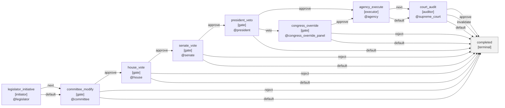
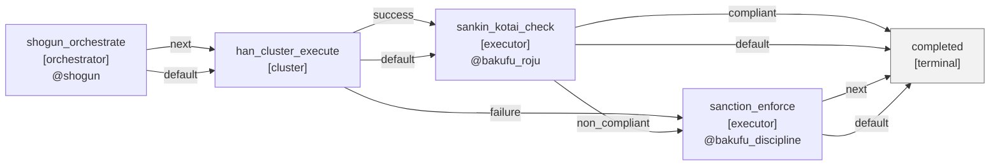

# MAS制度拓扑总览与分析（自动生成）

本文档基于 `systems/institutions.yaml` 的默认 spec 自动生成，覆盖当前仓库内全部制度。

## 总览指标
- 制度数: `8`
- Pattern 分布: `pipeline=4`, `gated_pipeline=2`, `consensus=1`, `autonomous_cluster=1`
- Gate 总数: `6`
- Feedback Loop 总数: `3`

## 快速对比表
| 制度 | pattern | stages | transitions | gates | auditors | loops | 并行点 |
|---|---:|---:|---:|---:|---:|---:|---|
| 雅典民主 | `consensus` | 5 | 11 | 0 | 1 | 0 | ekklesia_vote:consensus(31) |
| 秦汉郡县 | `pipeline` | 5 | 8 | 0 | 0 | 0 | none |
| 唐朝三省六部 | `gated_pipeline` | 6 | 13 | 1 | 0 | 3 | liubu_execution:cluster(6) |
| 蒙古帝国 | `pipeline` | 7 | 12 | 0 | 0 | 0 | none |
| 美国联邦 | `gated_pipeline` | 9 | 22 | 5 | 1 | 0 | none |
| 日本江户幕藩体制 | `autonomous_cluster` | 5 | 10 | 0 | 0 | 0 | han_cluster_execute:cluster(4) |
| 苏联党国体制 | `pipeline` | 6 | 10 | 0 | 0 | 0 | none |
| 古埃及法老制 | `pipeline` | 3 | 2 | 0 | 0 | 0 | none |

## 分析计划（下一步）
1. 拓扑复杂度分析：比较各制度的节点数、转移数、反馈回路数，定位高复杂度制度。
2. 控制权结构分析：统计 gate / auditor 密度，识别“强门控”和“弱门控”制度。
3. 并行度与吞吐分析：对 consensus/cluster 节点评估并行扇出与潜在成本。
4. Feature一致性分析：对照 `x_report_feature_catalog` 与运行时能力，标注 fully/partial 实现。
5. 风险点分析：识别默认决策与回路导致的潜在长链路或卡循环风险。

## 非默认拓扑变体（用于对照实验）
- 说明：以下为新增的 `variant spec`，不替换 `institutions.yaml` 中的默认 Oracle 实现，仅用于比较“拓扑表达力”。

### 雅典变体：开放提案 + 中段司法挑战 (`athens_open_challenge.yaml`)
- Path: `systems/institutions/athens_democracy/athens_open_challenge.yaml`
- Pattern: `consensus`
- 拓扑签名：`initiator(open citizen entry) -> gate(Boulē agenda filter) -> consensus -> auditor(mid-challenge) -> executor`
- 与默认版差异：
  1. 新增 `citizen_propose` 开放入口，不再由议事会作为唯一入口。
  2. `boule` 从 `planner` 改为 `gate`，可 `reject` 提案。
  3. `dikasteria` 从事后追溯，改为投票后执行前的中段审查。

### 苏联变体：政治局显式共识 + 地方偏差回环 (`soviet_consensus_loop.yaml`)
- Path: `systems/institutions/soviet_party_state/soviet_consensus_loop.yaml`
- Pattern: `consensus`
- 拓扑签名：`consensus(Politburo 5 voters) -> executors -> report_deviation loop back to consensus`
- 收敛保护：`loop_guard` 将 `republic_execute.report_deviation` 限制为最多 `3` 次，超限强制 `next`，避免 benchmark 被无限回环噪声污染
- 与默认版差异：
  1. 顶部节点从单 `planner` 改为显式 `consensus`（5 名政治局成员投票）。
  2. 新增 `republic_execute -> politburo_consensus` 回环，支持偏差上报后复议。

## 雅典民主 (`athens_democracy`)
- Default Spec: `systems/institutions/athens_democracy/athens_democracy.yaml`
- Pattern: `consensus` | Stages: `5` | Transitions: `11` | Gates: `0` | Auditors: `1` | Feedback Loops: `0`
- Parallel Consensus Points: `ekklesia_vote` voters=31
- Parallel Cluster Points: `none`
- Enabled Runtime Features: `monitor`, `shared_state`
- Report-Feature Mapping: `randomized_planner` -> external_or_adapter_level; `sampled_citizen_consensus` -> modeled_by_topology; `conditional_auditor` -> modeled_by_topology

### Topology

## 秦汉郡县 (`qinhan_junxian`)
- Default Spec: `systems/institutions/qinhan_junxian/qinhan_junxian.yaml`
- Pattern: `pipeline` | Stages: `5` | Transitions: `8` | Gates: `0` | Auditors: `0` | Feedback Loops: `0`
- Parallel Consensus Points: `none`
- Parallel Cluster Points: `none`
- Enabled Runtime Features: `monitor`
- Report-Feature Mapping: `monitor` -> built_in

### Topology

## 唐朝三省六部 (`tang_sanshengliubu`)
- Default Spec: `systems/institutions/tang_sanshengliubu/tang_sanshengliubu.yaml`
- Pattern: `gated_pipeline` | Stages: `6` | Transitions: `13` | Gates: `1` | Auditors: `0` | Feedback Loops: `3`
- Parallel Consensus Points: `none`
- Parallel Cluster Points: `liubu_execution` members=6
- Enabled Runtime Features: `none`
- Report-Feature Mapping: `gate_reject_loop` -> modeled_by_topology; `exceptional_override` -> modeled_by_topology

### Topology

## 蒙古帝国 (`mongol_empire`)
- Default Spec: `systems/institutions/mongol_empire/mongol_empire.yaml`
- Pattern: `pipeline` | Stages: `7` | Transitions: `12` | Gates: `0` | Auditors: `0` | Feedback Loops: `0`
- Parallel Consensus Points: `none`
- Parallel Cluster Points: `none`
- Enabled Runtime Features: `none`
- Report-Feature Mapping: `recursive_executor` -> modeled_by_multistage_pipeline
- Runtime Guardrails: 全链路 agent 已配置 `timeout_sec=45` 与 `retries=1`，用于降低深链路卡住风险

### Topology

```mermaid
flowchart LR
    khagan_order["khagan_order\n[initiator]\n@khagan"]
    imperial_plan["imperial_plan\n[planner]\n@imperial_secretariat"]
    tumen_level_execute["tumen_level_execute\n[executor]\n@tumen_commander"]
    mingghan_level_execute["mingghan_level_execute\n[executor]\n@mingghan_commander"]
    jaghun_level_execute["jaghun_level_execute\n[executor]\n@jaghun_commander"]
    arban_level_execute["arban_level_execute\n[executor]\n@arban_commander"]
    completed["completed\n[terminal]"]
    khagan_order -- "next" --> imperial_plan
    khagan_order -- "default" --> imperial_plan
    imperial_plan -- "next" --> tumen_level_execute
    imperial_plan -- "default" --> tumen_level_execute
    tumen_level_execute -- "next" --> mingghan_level_execute
    tumen_level_execute -- "default" --> mingghan_level_execute
    mingghan_level_execute -- "next" --> jaghun_level_execute
    mingghan_level_execute -- "default" --> jaghun_level_execute
    jaghun_level_execute -- "next" --> arban_level_execute
    jaghun_level_execute -- "default" --> arban_level_execute
    arban_level_execute -- "next" --> completed
    arban_level_execute -- "default" --> completed
    style completed fill:#f2f2f2,stroke:#777,stroke-width:1px
```

## 美国联邦 (`us_federal`)
- Default Spec: `systems/institutions/us_federal/us_federal_gated.yaml`
- Pattern: `gated_pipeline` | Stages: `9` | Transitions: `22` | Gates: `5` | Auditors: `1` | Feedback Loops: `0`
- Parallel Consensus Points: `none`
- Parallel Cluster Points: `none`
- Enabled Runtime Features: `none`
- Report-Feature Mapping: `multigate_pipeline` -> modeled_by_topology; `veto_override_path` -> modeled_by_topology; `auditor_invalidate` -> modeled_by_topology

### Topology

## 日本江户幕藩体制 (`edo_bakuhan`)
- Default Spec: `systems/institutions/edo_bakuhan/edo_bakuhan.yaml`
- Pattern: `autonomous_cluster` | Stages: `5` | Transitions: `10` | Gates: `0` | Auditors: `0` | Feedback Loops: `0`
- Parallel Consensus Points: `none`
- Parallel Cluster Points: `han_cluster_execute` members=4
- Enabled Runtime Features: `monitor`
- Report-Feature Mapping: `monitor` -> built_in; `orchestrator_heartbeat_control` -> modeled_by_topology

### Topology

## 苏联党国体制 (`soviet_party_state`)
- Default Spec: `systems/institutions/soviet_party_state/soviet_party_state.yaml`
- Pattern: `pipeline` | Stages: `6` | Transitions: `10` | Gates: `0` | Auditors: `0` | Feedback Loops: `0`
- Parallel Consensus Points: `none`
- Parallel Cluster Points: `none`
- Enabled Runtime Features: `none`
- Report-Feature Mapping: `planner_internal_consensus` -> modeled_by_soul_and_agent_instructions

### Topology

## 古埃及法老制 (`egypt_pipeline`)
- Default Spec: `systems/institutions/egypt_pipeline/egypt_pipeline.yaml`
- Pattern: `pipeline` | Stages: `3` | Transitions: `2` | Gates: `0` | Auditors: `0` | Feedback Loops: `0`
- Parallel Consensus Points: `none`
- Parallel Cluster Points: `none`
- Enabled Runtime Features: `monitor`
- Report-Feature Mapping: `none`

### Topology

